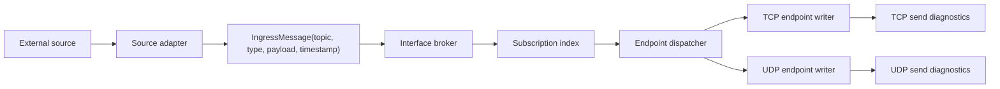

# Interface Server endpoint model 설계

- 날짜: 2026-06-16
- 상태: 구현 전 리뷰 대상
- 범위: 설계 재정렬 문서. 코드 구현은 포함하지 않는다.

## 목표 재정의

이 프로젝트의 목표는 단순 TCP pub/sub broker 에서 끝나는 것이 아니라, 외부 시스템에서 들어온 정보를 받아 구독된 endpoint 로 발행하는 Interface Server 이다. DDS와 유사하게 topic 을 기준으로 데이터를 분배하지만, 현재 v1 범위에서는 DDS 전체 호환성, discovery, RTPS, durable history, 신뢰성 있는 UDP 재전송까지 포함하지 않는다.

새 기준 목표는 다음과 같다.

- 외부 source adapter 가 topic, data type, payload, source timestamp 를 가진 ingress message 를 만든다.
- broker 는 topic 과 선택적 data type 조건에 맞는 subscription 을 찾는다.
- 각 subscription 은 connection 객체가 아니라 안정적인 endpoint identity 를 기준으로 관리한다.
- endpoint 는 TCP 또는 UDP transport 를 가질 수 있고, transport 별 send 정책과 관측값을 가진다.
- 발행 경로는 구독자당 payload 복사를 만들지 않고 기존 `RefCountedBuffer` fan-out 소유권 규율을 유지한다.

## 현재 구현과의 차이

현재 구현은 Phase 1~3 기준으로 TCP broker 경로를 완성했다. `BrokerServer + SaeaTransport`는 TCP command 를 받아 topic 별 `IConnection` 구독자에게 fan-out 할 수 있고, TCP/UDP transport primitive 와 drop counter 도 존재한다.

남은 차이는 다음이다.

- subscription key 가 아직 endpoint identity 가 아니라 `IConnection` 중심이다.
- UDP transport 는 bind/send/receive/echo 기준선만 있고 broker pub/sub 경로에 결선되지 않았다.
- TCP/UDP endpoint 별 QoS, pending depth, high-watermark, drop reason 같은 송신 측 상태 모델이 부족하다.
- benchmark 는 subscriber 수신 latency 를 측정하지만, 어떤 endpoint 의 send queue 가 밀렸는지 직접 설명하지 못한다.

따라서 다음 설계 우선순위는 latency SLO gate 를 바로 추가하는 것이 아니라, endpoint 중심 송신 상태를 먼저 관측 가능하게 만드는 것이다. SLO gate 는 이 관측값을 소비하는 후속 판단이어야 한다.

## 제안 구조

### Source adapter

외부 정보를 broker 내부 모델로 바꾸는 경계다. 다만 이 절은 장기 모델을 설명한다. 다음 1순위 구현 단위인 send queue high-watermark diagnostics 에서는
`TcpCommand` wire format, broker publish API, `IngressMessage` 타입을 변경하지 않는다. 아래 필드는 EndpointId/snapshot 이후 별도 publish model 단위에서 다시 다룬다.

- topic: routing key
- data type id: 선택적 type/schema 구분자
- payload: `RefCountedBuffer`와 offset/length
- source timestamp: latency 측정과 ordering 진단에 사용
- source id: 여러 외부 source 를 구분해야 할 때 사용

### Endpoint registry

endpoint 는 connection 보다 긴 수명 개념이다. TCP reconnect 나 UDP remote endpoint 를 같은 논리 subscriber 로 다루려면 stable id 가 필요하다.

초기 모델은 다음 속성만 요구한다.

- endpoint id
- transport kind: TCP 또는 UDP
- current transport handle: TCP 는 `IConnection`, UDP 는 `IUdpEndpoint`와 remote `EndPoint`
- state: Open, Closing, Closed, Faulted
- diagnostics: pending send count, pending high-watermark, dropped count, last drop reason, last send timestamp

### Subscription index

현재 `SubscriptionTable`의 topic 기반 set 구조는 유지할 수 있다. 다만 value 를 장기적으로 `IConnection`에서 endpoint reference 로 옮겨야 한다.

단계적 전환은 다음 순서가 안전하다.

1. 현재 TCP 경로는 그대로 둔 채 send queue high-watermark 를 먼저 추가한다.
2. endpoint id 와 endpoint snapshot 모델을 도입한다.
3. `SubscriptionTable` value 를 endpoint 중심으로 바꾼다.
4. UDP endpoint subscription 을 별도 wire/control 정책 결정 뒤 연결한다.

### Endpoint dispatcher

dispatcher 는 topic fan-out 결과를 transport 별 writer 로 나눈다. 이 계층은 payload 복사를 만들지 않고, 기존 D009 규칙을 따른다.

- TCP endpoint: `ITransport.TrySend(IConnection, TransportSendBuffer)`를 사용한다.
- UDP endpoint: `ITransport.TrySendTo(IUdpEndpoint, EndPoint, TransportSendBuffer)` 경로를 사용한다.
- enqueue 실패 또는 정책상 drop 이 발생하면 해당 endpoint diagnostic 을 갱신한다.
- 발행자 guard ref 와 endpoint 별 AddRef/Release 순서는 기존 `BrokerPublisher` 규칙을 유지한다.

## TCP와 UDP 정책 차이

TCP endpoint 는 연결 지향이다. 연결이 닫히면 broker 는 subscription cleanup 을 수행하고, reconnect 를 같은 endpoint 로 볼지는 별도 정책이다. TCP 는 stream protocol 이므로 현재 length-prefixed command framing 을 유지한다.

UDP endpoint 는 datagram 지향이다. `1 datagram = 1 message` 규칙은 유지하되, v1 에서는 신뢰성, 재전송, 순서 보장, congestion control 을 제공하지 않는다. UDP subscription 을 어떻게 등록할지는 아직 결정하지 않는다. 자연스러운 후보는 TCP control plane 에서 UDP remote endpoint 를 등록하는 방식과, UDP datagram 자체에 subscription command 를 싣는 방식이다. 이 선택은 UDP broker v1 단위에서 별도 결정한다.

## 송신 측 관측성

사용자가 우려한 send 쪽 문제는 타당하다. receive latency 만 보면 실제 병목이 subscriber socket, transport send queue, OS scheduling, broker fan-out 중 어디인지 구분하기 어렵다.

따라서 다음 구현의 첫 단위는 endpoint model 전체 도입보다 작게, TCP/UDP send queue high-watermark diagnostics 로 잡는 것이 좋다.

필요한 최소 관측값은 다음이다.

- TCP pending send queue high-watermark: transport 수명 동안 어떤 단일 TCP connection 이 도달한 최대 pending depth
- UDP pending send queue high-watermark: transport 수명 동안 어떤 단일 UDP endpoint queue 가 도달한 최대 pending depth
- 누적 dropped count
- 가능하면 마지막 drop 이 발생한 transport kind 또는 endpoint 범위

이 값은 아직 endpoint identity 를 알려주지 않는다. endpoint registry 도입 전에는 "어떤 endpoint"가 아니라 TCP/UDP transport kind 별 lifetime max 로 해석한다.
또한 현재 큐는 capacity 16 bounded drop-oldest 이므로 high-watermark 는 capacity 에서 포화된다. HWM=16은 천장 도달 신호이고,
얼마나 오래 또는 얼마나 많이 뒤처졌는지는 drop count 와 함께 해석해야 한다.

current queue depth 는 connection 이 닫힌 뒤 의미가 약하므로 v1 public snapshot 에서는 high-watermark 가 더 안정적이다. 이후 endpoint registry 가 생기면 endpoint 별 current depth 를 추가할 수 있다.

## Backpressure 해석

현재 구현의 drop-oldest 는 최신 데이터 우선 정책에 가깝다. Interface Server 가 외부 최신 상태를 배포하는 시스템이라면 이 정책은 합리적일 수 있다. 반대로 command, event log, 누락 불가 데이터라면 disconnect 또는 reject 정책이 더 맞다.

따라서 v1 기본 정책은 topic 또는 endpoint QoS 결정 전까지 다음처럼 문서화한다.

- 기본 transport queue 는 현재 구현대로 bounded drop-oldest 이다.
- 메시지 손실은 diagnostics 로 반드시 관측 가능해야 한다.
- durable/reliable delivery 는 v1 범위가 아니다.
- 데이터 성격별 정책 선택은 endpoint QoS 설계에서 다룬다.

## 다음 구현 단위 제안

### 1순위: TCP/UDP send queue high-watermark diagnostics

가장 작고 검증 가능한 단위다. 기존 `TransportConnection`, `SaeaUdpEndpoint`, `TransportDiagnosticsSnapshot`, benchmark report 를 확장하면 된다. endpoint registry 를 아직 도입하지 않아도 send 쪽 병목 여부를 설명할 수 있다.

검증은 transport 단위 테스트에서 queue 가 capacity 까지 찬 뒤 high-watermark 가 증가하는지 확인하고, benchmark report 에 해당 key 가 항상 출력되는지 확인하는 방식이 적합하다.
구현은 닫힌 connection/endpoint 를 나중에 훑는 방식이 아니라 enqueue 직후 계산한 depth 로 `TransportBase`의 transport-wide max 를 갱신하는 방식이 안전하다.
그래야 connection 이 닫힌 뒤에도 snapshot 이 transport 수명 동안의 최대값을 잃지 않는다.

### 2순위: EndpointId 와 endpoint snapshot 최소 계약

endpoint 중심 broker 로 가기 위한 모델링 단위다. 단, 이 작업은 `SubscriptionTable`, broker handler, diagnostics surface 에 영향을 줄 수 있으므로 high-watermark 보다 넓다. 먼저 관측성을 확보한 뒤 진행하는 편이 리뷰하기 쉽다.

### 3순위: UDP broker v1 wire/control 정책 결정

UDP transport primitive 는 준비되어 있지만 subscription 등록 방식이 정해지지 않았다. TCP control plane 과 UDP self-register 중 하나를 선택해야 하므로, 바로 구현하지 않고 별도 설계 단위로 둔다.

## 범위 밖

이번 설계 문서는 다음을 구현 대상으로 삼지 않는다.

- DDS wire protocol 호환성
- discovery, participant, domain id, RTPS
- UDP 신뢰성, 재전송, 순서 보장, congestion control
- persistence 또는 durable history
- schema registry
- TLS, 인증, 권한
- cluster 또는 cross-process replication
- latency SLO 실패 gate

## 검증 방향

다음 구현부터는 기존 3색 TDD 규칙을 유지한다. 다만 이번 문서화 단위는 코드 변경이 없으므로 build/test 대신 문서 일관성, state file 동기화, whitespace 검증으로 닫는다.

다음 코드 단위가 high-watermark diagnostics 라면 검증 기준은 다음과 같다.

- Red: transport diagnostics snapshot 에 high-watermark 필드가 없어 테스트가 단언 실패한다.
- Green: TCP/UDP pending queue enqueue 경로가 최대 depth 를 갱신한다.
- Refactor: counter update helper 이름이 정책 의도를 드러내도록 정리한다.
- Regression: `dotnet build HighPerformanceSocket.slnx`, `dotnet test HighPerformanceSocket.slnx`, `git diff --check`.
