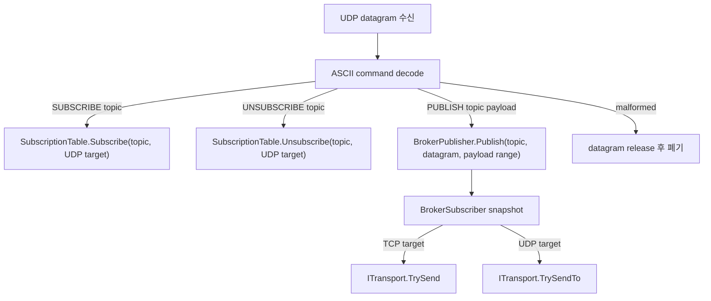

# UDP broker v1 runtime target wire/control 설계

## 목적

이 문서는 D059 이후 남은 UDP broker v1 결선 방식을 확정한다. 목표는 stable subscriber identity, `REGISTER`,
reconnect subscription transfer 없이도 UDP remote 를 runtime send target 으로 등록하고, 기존 TCP broker fan-out
경계와 같은 소유권 규칙으로 payload 를 발행할 수 있게 하는 것이다.

이번 문서는 설계 단위이며 production code, public API, 테스트 코드는 변경하지 않는다.

## 확정 결정

- UDP v1은 별도 TCP control plane 으로 UDP remote 를 등록하지 않는다.
- UDP v1은 같은 bound UDP socket 으로 들어오는 datagram payload 를 broker command 로 해석한다.
- UDP subscriber runtime target 은 `(IUdpEndpoint localEndpoint, EndPoint remoteEndPoint)` 조합이다.
- stable id, `EndpointId`, reconnect rebinding, `REGISTER`, `SUBSCRIBE ... AS ...`는 사용하지 않는다.
- v1 UDP command set 은 `SUBSCRIBE <topic>`, `UNSUBSCRIBE <topic>`, `PUBLISH <topic> <payload>`로 시작한다.
- malformed UDP command 는 해당 datagram 만 폐기하고 shared UDP endpoint 를 닫지 않는다.
- stale remote 정리는 v1에서 explicit `UNSUBSCRIBE`와 UDP endpoint close cleanup 으로만 처리한다. idle expiry 는 후속 backlog 로 둔다.

## 왜 UDP self-command 인가

TCP control plane 으로 UDP remote 를 등록하는 방식은 host 가 TCP connection, UDP endpoint, remote address 문자열,
주소 검증, NAT/port 변경 정책을 함께 다뤄야 한다. 이는 D059에서 제외한 stable identity/rebinding 문제를 다시 끌어온다.

UDP datagram self-command 방식은 이미 존재하는 Transport 경계와 가장 잘 맞는다. `ITransportDatagramHandler`는
bound endpoint 와 remote `EndPoint`를 함께 받으므로, command 를 보낸 remote 를 곧바로 runtime send target 으로 삼을 수 있다.
또한 `1 datagram = 1 message` 원칙을 유지해 조립 상태머신이나 cross-transport registry 를 추가하지 않는다.

## Wire command

UDP command payload 는 ASCII token 기반으로 해석한다. v1은 TCP command 와 같은 텍스트 스타일을 유지하되,
UDP에는 per-remote close notification 이 없으므로 `UNSUBSCRIBE`를 command set 에 포함한다.

| Command | 의미 | payload 소유권 |
| --- | --- | --- |
| `SUBSCRIBE <topic>` | datagram 을 보낸 remote 를 topic subscriber 로 등록한다. | datagram guard ref 는 handler 가 즉시 release 한다. |
| `UNSUBSCRIBE <topic>` | datagram 을 보낸 remote 를 topic 에서 제거한다. 없는 구독은 no-op 이다. | datagram guard ref 는 handler 가 즉시 release 한다. |
| `PUBLISH <topic> <payload>` | payload slice 를 해당 topic subscriber 들에게 fan-out 한다. | datagram guard ref 는 publish guard 로 사용하고 publish 후 handler 가 release 한다. |

TCP path 도 같은 command grammar 로 `UNSUBSCRIBE`를 받아도 구조적으로 안전하다. 다만 실제 구현은 작은 단위로 나누며,
첫 코드 단위에서 TCP behavior 까지 넓힐지 여부는 테스트 범위와 함께 다시 확인한다.

## Runtime target model

`BrokerSubscriber`는 TCP `IConnection`뿐 아니라 UDP target 도 표현할 수 있어야 한다.

- TCP target: 현재와 같이 `IConnection`.
- UDP target: `IUdpEndpoint`와 remote `EndPoint`.
- equality/hash: UDP target 은 endpoint object identity 와 remote endpoint equality 를 함께 사용한다.
- transport kind: TCP는 `EndpointTransportKind.Tcp`, UDP는 `EndpointTransportKind.Udp`.
- send: TCP는 `ITransport.TrySend(connection, TransportSendBuffer)`, UDP는 `ITransport.TrySendTo(endpoint, remoteEndPoint, TransportSendBuffer)`.

`EndpointId`는 diagnostics id 이므로 routing key 로 쓰지 않는다. UDP target 은 실제 send 에 필요한 runtime handle 조합만 가진다.

## Cleanup policy

UDP는 TCP connection close 와 같은 per-remote lifecycle event 가 없다. 따라서 v1의 cleanup 은 다음으로 제한한다.

- `UNSUBSCRIBE <topic>`: 해당 remote target 을 topic 에서 제거한다.
- UDP endpoint close: 해당 local endpoint 에 묶인 모든 UDP subscriber 를 제거한다.
- duplicate `SUBSCRIBE`: idempotent 하게 같은 target 을 유지한다.
- duplicate `UNSUBSCRIBE`: no-op 으로 처리한다.
- idle expiry: v1 구현 범위 밖이다. 장시간 stale remote 축적이 실제 운영 문제로 확인되면 별도 정책으로 설계한다.

이 정책은 자동 expiry 가 없어 stale remote 를 완전히 막지는 못한다. 대신 v1에서 timer, last-seen timestamp, sweep 비용,
clock 의존성을 추가하지 않고, explicit control 과 endpoint 수명 정리만 먼저 검증한다.

## 처리 흐름

## 다음 구현 분해

1. `BrokerSubscriber`에 UDP runtime target 값을 추가한다.
   - public 생성 진입점은 `ForUdp(IUdpEndpoint, EndPoint)` 형태가 가장 작다.
   - `BrokerPublisher`는 `TransportKind`에 따라 TCP/UDP send 를 분기한다.
   - 이 단계는 datagram command parser 나 server wiring 을 아직 만들지 않는다.

2. command grammar 에 `UNSUBSCRIBE <topic>`를 추가한다.
   - parser 테스트는 command 의미와 payload slice 경계를 먼저 고정한다.
   - TCP handler 지원을 같이 넣을지, UDP handler 구현 때 넣을지는 Red 범위로 결정한다.

3. UDP broker datagram handler 를 추가한다.
   - `SUBSCRIBE`와 `UNSUBSCRIBE`는 remote target 등록/해지만 수행한다.
   - `PUBLISH`는 받은 datagram buffer 의 payload slice 를 추가 복사 없이 fan-out 한다.
   - malformed command 는 endpoint close 없이 datagram 만 release 한다.

4. `BrokerServer`에 UDP bind/handler wiring 을 붙인다.
   - TCP-only server 동작은 유지한다.
   - UDP endpoint close 시 local endpoint 에 묶인 subscriber cleanup 을 연결한다.

## 검증 계획

- Broker 단위 테스트: UDP `BrokerSubscriber` equality/hash, snapshot copy, TCP/UDP mixed fan-out.
- Protocol 단위 테스트: `UNSUBSCRIBE`, malformed UDP/TCP command 경계.
- Broker UDP handler 테스트: subscribe, unsubscribe, publish payload range, malformed drop-only, refcount leak 0.
- Server/Transport 통합 테스트: 실제 UDP subscribe 후 TCP 또는 UDP publish 가 UDP remote 로 fan-out 되는 loopback 경로.

## 범위 밖

- stable subscriber identity.
- reconnect subscription transfer.
- TCP control plane 으로 UDP remote 를 등록하는 방식.
- idle expiry, last-seen timestamp, sweep timer.
- UDP 신뢰성, 재전송, 순서 보장, discovery.
- protocol error 응답 payload.
