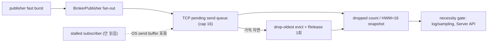

# drop-oldest stress 시나리오 + drop 관측성 필요성 설계

- 날짜: 2026-06-18
- 상태: Resolved (D066/D067/D068로 반영 완료)
- 관련 결정: D012, D041, D042, D051, D055, D062, D063, D064, D066, D067, D068
- 관련 검토: `.claude/review/2026-06-18-outbound-framing-and-state.md`, `.claude/review/2026-06-17-impl-vs-design-cross-verification.md`
- 선행 정정: 직전 검토(`2026-06-18-outbound-framing-and-state.md` §5)가 "drop 경로 미실행"이라 적었으나,
  정확히는 **open-loop runner(`--load-open-loop`, D051)는 이미 존재**한다. 다만 그 실측이 dropped 0 / TCP HWM 3 으로
  **drop-oldest 가 여전히 한 번도 fire 하지 않는다**(아래 §1 참조). 이 spec 은 그 한계를 닫는 단위다.

> 현재 상태: 이 문서는 drop-oldest stress 구현 전 작성된 설계 제안의 원문을 보존한다. 제안의 본체였던 stalled TCP
> subscriber stress 는 D066의 Server 통합 테스트로 반영 완료됐다. drop log/sampling 은 D066으로 보류됐고,
> configurable backpressure/QoS policy surface 는 D067로 v1 제외, `BrokerServer` convenience diagnostics API 는
> D068로 v1 제외 결정이 내려졌다. 따라서 아래 TDD 단계는 현재 다음 작업 지시가 아니라 당시 구현 계획 기록이다.

## 목적

bounded drop-oldest 백프레셔(D012/D064)가 실제로 동작하는지 **결정론적으로 fire 시키는 stress 시나리오**를 만들고,
그 위에서 **drop log/sampling 과 Server convenience diagnostics API 의 필요성**을 판단한다.

두 작업을 한 단위로 묶는 이유: drop 관측성의 "필요성"과 "테스트 가능성"은 drop 이 실제로 발생하는 시나리오가
있어야만 평가할 수 있다. drop 이 0 인 상태에서 drop 관측 API 를 먼저 만들면 그 API 가 fire 하는지 검증할 수단이 없다.

## 확인된 현재 구현

- **백프레셔**: `TransportConnection.TryAcceptSend` / `SaeaUdpEndpoint.TryAcceptSend` 가 capacity 16 bounded drop-oldest.
  evict 한 `RefCountedBuffer` 를 락 안에서 큐 제거 후 락 밖에서 정확히 1회 Release (D012).
- **관측성(pull-only)**: `ITransportDiagnostics.GetDiagnosticsSnapshot()` →
  `TransportDiagnosticsSnapshot { Tcp/UdpDroppedPendingSendCount, Tcp/UdpPendingSendQueueHighWatermark }`.
  reset 되지 않는 누적 counter, lock 없는 원자적 snapshot. 마지막 drop 메타데이터(timestamp/endpoint)는 **D062 로 v1 제외**.
- **기존 stress 시도**: `TcpLoopbackScenarioRunner.RunOpenLoopAsync()` 는 publisher 가 receive 완료를 기다리지 않지만,
  단일 loopback subscriber 가 100Hz×4096B 를 쉽게 따라잡아 pending queue 가 capacity 16 에 도달하지 못한다.
  D063 실측: dropped 0, TCP HWM 3. → **drop-oldest evict 분기와 HWM 포화(=16) 분기가 한 번도 실행되지 않음.**
- **Server 표면**: `BrokerServer` 는 transport 를 감싸지만 diagnostics 를 다시 노출하지 않는다. 운영자는
  `(ITransportDiagnostics)transport` 로 직접 캐스팅해야 snapshot 을 읽는다.

## 결정 (제안)

### 1. drop-oldest stress 시나리오를 먼저 만든다 (이 단위의 본체)

소비자를 의도적으로 정체시켜 pending send queue 가 capacity 16 에 포화되고 drop-oldest 가 evict 하도록 강제한다.

- **메커니즘**: subscriber 가 SUBSCRIBE 후 **socket 을 읽지 않고 정체**시킨다 → OS send buffer 포화 →
  broker 의 `SendAsync` 가 pend → `TransportConnection._pendingSends` 가 자라 capacity 16 도달 → drop-oldest evict.
  결정론을 위해 충분히 많은 메시지를 빠르게 발사하고, 필요 시 subscriber `SO_RCVBUF` / broker `SO_SNDBUF` 를
  작게 잡아 포화를 빠르고 안정적으로 만든다.
- **단언**:
  - `DroppedPendingSendCount > 0` (drop-oldest 분기 실행됨)
  - `TcpPendingSendQueueHighWatermark == 16` (capacity 천장 포화 관측됨)
  - 종료 후 `pool.RentedCount == 0` (evict + close drain 에서 누수·이중반환 0 — D012 회귀)
  - evict 된 메시지 수 + 전달된 메시지 수의 일관성(손실은 dropped 로만 설명되어야 함)
- benchmark runner 가 아니라 **통합 테스트**(예: `tests/Hps.Server.Tests` 또는 transport 단위 테스트)로 두는 것을
  권장한다. 결정론적 단언이 목적이고, 처리량/지연 수치는 부차적이기 때문이다.

### 2. drop log/sampling 은 stress 결과로 필요성을 가른다 (necessity gate)

stress 시나리오가 생기면 다음 질문에 답할 수 있다: "누적 dropped count + HWM 포화(=16) snapshot 만으로
운영자가 백프레셔 손실을 충분히 설명할 수 있는가?"

- **권고(기본값)**: **defer.** v1 의 pull-only snapshot 이 손실 발생(dropped>0)과 천장 도달(HWM=16)을 이미
  관측 가능하게 한다. drop 마다 동기 log 를 남기면 과부하 시 log 자체가 비용·노이즈가 되고(D062 의 최소주의와 일관),
  핫패스(drop-oldest evict 는 send 락 안)에서 log/sampling 분기는 할당·I/O 위험이 있다.
- **gate**: stress 테스트에서 snapshot 만으로 손실을 설명할 수 없는 구체적 부족이 드러나면 그때 sampling/threshold
  log 를 별도 단위로 승격한다. 부족이 없으면 D062 계열 결정으로 "snapshot 으로 충분, log/sampling 보류"를 확정 기록한다.

### 3. Server convenience diagnostics API 도 necessity gate 로 둔다

- **권고(기본값)**: **작게 추가하거나 보류** — 둘 다 합리적이며 사용자 결정 사항.
  - 추가안: `BrokerServer` 에 nullable pass-through accessor(예: `TransportDiagnosticsSnapshot? GetTransportDiagnostics()`)
    를 두어 host 코드가 transport 를 캐스팅하지 않게 한다. 표면이 작고 위험이 낮다.
  - 보류안: 실제 운영 host surface(여러 transport 합산, endpoint registry)가 구체화된 뒤 결정(D062 후속 문구와 일관).
- transport 가 2개 이상이면 snapshot 합산 시 EndpointId 충돌(직전 검토 O1)이 관련되므로, 단일 transport pass-through
  이상으로 키우지 않는다.

## 기각한 대안

- **A: 기존 open-loop runner 의 rate 만 올려 drop 유발.** 머신/타이밍 의존이라 비결정적이고 CI 에서 flaky.
  소비자 정체로 큐를 포화시키는 편이 결정론적이다.
- **B: drop 관측성(log/sampling)을 stress 없이 먼저 구현.** drop 이 발생하지 않아 fire 검증 불가. 본 spec 의 묶음 이유와 정면 충돌.
- **C: capacity 16 을 테스트에서 더 키워 포화 회피.** 포화 분기를 검증하려는 목적과 반대.

## 구현 당시 TDD 계획 (완료/대체됨)

현재 상태: 이 계획의 stress 시나리오는 D066의 stalled TCP subscriber stress 통합 테스트로 반영됐다. 아래 단계는 현재 실행 지시가 아니라 당시 구현 계획 기록이다.

1. **Red**
   - 정체 subscriber + 다수 메시지 발사 stress 테스트 작성. 현재 코드에서 `DroppedPendingSendCount > 0` &
     `TcpPendingSendQueueHighWatermark == 16` 단언이 **실제로 fire 하는지** 먼저 확인(현 runner 로는 dropped 0 이라 실패해야 정상).
   - 주석에 "closed/open-loop 는 소비자가 따라잡아 drop-oldest 를 fire 하지 못하므로 소비자 정체로 큐를 포화시킨다"는 의도를 한국어로 남긴다.
2. **Green**
   - 소비자 정체 시나리오로 drop-oldest evict 분기·HWM 포화를 결정론적으로 유발하고 단언을 통과시킨다.
   - 종료 후 `RentedCount == 0` 회귀 유지.
3. **Refactor**
   - 필요 시 socket buffer 크기 knob 정리. 기존 closed/open-loop runner 는 그대로 둔다(처리량/지연 baseline 용도).
   - stress 결과를 근거로 §2/§3 necessity 결정을 `DECISIONS.md` 에 기록.

## 영향 범위

- `tests/Hps.Server.Tests/` 또는 `tests/Hps.Transport.Tests/` (stress 통합 테스트 신설)
- 선택: `tests/Hps.Benchmarks/` (stress 를 benchmark runner 로도 노출할지)
- 선택: `src/Hps.Server/BrokerServer.cs` (§3 채택 시 nullable diagnostics accessor)
- `DECISIONS.md` / `TODOS.md` / `CURRENT_PLAN.md` (necessity 결정 기록)

## 범위 밖

- 마지막 drop timestamp/endpoint attribution (D062 유지).
- configurable backpressure/QoS policy surface (별도 `P2_LATER`).
- 느린 소비자 disconnect/reject 정책(현재는 drop-oldest 유지가 v1 — D064).
- 다중 transport 합산 diagnostics, endpoint registry, EndpointId 충돌 해소(O1, 후속).
- latency hard SLO gate 변경(D063 유지).

## 완료 기준

현재 기준 완료 상태는 D066/D067/D068과 `CURRENT_PLAN.md`/`TODOS.md`의 완료 항목을 따른다. 아래 기준은 이 설계가 처음 제안됐을 때의 완료 조건이다.

- 소비자 정체 stress 에서 `DroppedPendingSendCount > 0` 와 `TcpPendingSendQueueHighWatermark == 16` 이 결정론적으로 관측된다.
- 같은 stress 종료 후 `RentedCount == 0` 회귀가 유지된다(evict + close drain 누수/이중반환 0).
- drop log/sampling 과 Server convenience diagnostics API 의 필요성 판단이 `DECISIONS.md` 에 결론으로 기록된다(추가 또는 보류).
- 기존 closed/open-loop benchmark 와 전체 테스트 실패 0 이 유지된다.

