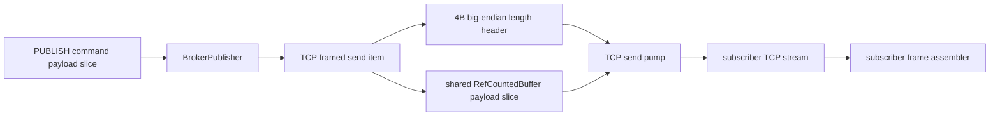

# TCP outbound framing 정책 설계

- 날짜: 2026-06-18
- 상태: Accepted
- 관련 결정: D010, D015, D057, D064, D065
- 관련 검토: `.claude/review/2026-06-17-impl-vs-design-cross-verification.md`

## 목적

TCP subscriber 가 broker 에서 발행된 메시지를 out-of-band 길이 정보 없이도 안정적으로 구분할 수 있도록
broker->TCP subscriber outbound wire contract 를 확정한다.

현재 inbound TCP command 는 `4-byte big-endian length prefix + payload` 프레임을 사용하지만,
outbound fan-out 은 `BrokerPublisher`가 publish payload slice 를 그대로 `TransportSendBuffer`로 보내므로
subscriber 쪽에서는 메시지 경계를 알 수 없다. 4096B 고정 크기 benchmark 에서는 수신자가 길이를 미리 알고 있어
문제가 드러나지 않았지만, Interface Server 의 실제 발행 모델에서는 가변 길이 메시지와 연속 메시지를 처리해야 한다.

## 확인된 현재 구현

- TCP inbound: `TcpFrameAssembler`가 4바이트 big-endian length prefix 를 읽고 payload frame 을 조립한다.
- Broker publish: `BrokerTcpFrameHandler`가 `PUBLISH <topic> <payload>` command 의 payload range 만
  `BrokerPublisher.Publish(topic, frame, payloadOffset, payloadLength)`로 넘긴다.
- TCP outbound: `BrokerPublisher`는 `TransportSendBuffer(payloadBuffer, offset, length)`를 만들어
  `ITransport.TrySend(connection, sendBuffer)`로 보낸다.
- 결과: TCP subscriber 는 raw payload byte stream 만 받는다. 여러 메시지가 이어지거나 payload 길이가 달라지면
  subscriber 가 메시지 경계를 복원할 수 없다.

## 결정

TCP broker->subscriber outbound 메시지도 inbound 와 같은 `4-byte big-endian length prefix + payload` 프레임으로 보낸다.

UDP는 기존 원칙대로 `1 datagram = 1 message`를 유지하며, UDP outbound 에 length prefix 를 추가하지 않는다.

## 핵심 불변식

TCP outbound framing 을 추가하더라도 payload 를 구독자마다 새 버퍼로 복사하지 않는다.

허용되는 추가 비용은 메시지별 4바이트 header metadata 뿐이다. payload 는 기존 `RefCountedBuffer + offset + length`
slice 를 그대로 공유해야 한다. 즉, 구현은 다음 조건을 만족해야 한다.

- 구독자당 payload 복사 0회.
- drop-oldest, close drain, in-flight unwind 에서 payload `RefCountedBuffer` transport 소유 ref 는 정확히 1회 Release.
- header 와 payload 는 하나의 논리적 송신 항목으로 취급되어 drop-oldest 가 header 만 남기거나 payload 만 버리는 상태를 만들지 않는다.
- TCP send pump 는 한 logical message 의 header 와 payload 를 모두 전송한 뒤 다음 queue 항목으로 넘어간다.
- 향후 RIO/io_uring backend 에서는 같은 logical send item 을 vectored/scatter-gather send 로 최적화할 수 있어야 한다.

## 구현 방향

권장 구현은 "framed/composite send request" 이다.

현재 `TransportSendBuffer`는 raw payload slice 하나만 표현한다. TCP framed outbound 에서는 이 값을 그대로 대체하지 말고,
transport pending queue 가 처리할 수 있는 논리적 송신 요청을 다음처럼 확장하는 방향이 안전하다.

```text
Tcp outbound logical send item
  header: 4-byte big-endian payload length, inline value 또는 작은 고정 필드
  payload: RefCountedBuffer + offset + length
  release owner: payload RefCountedBuffer transport ref 1개
```

SAEA 기준선에서는 send pump 가 header 4바이트를 먼저 보내고, 이어서 payload slice 를 보낸다.
이 두 write 는 하나의 in-flight handle 수명 안에서 처리해 payload release 경계를 하나로 유지한다.
future backend 는 같은 logical item 을 scatter/gather send 로 내려 한 번의 커널 호출에 가깝게 최적화할 수 있다.

## 기각한 대안

### 대안 A: header + payload 를 새 버퍼로 합쳐 subscriber 마다 전송

구현은 단순하지만 payload 를 subscriber 수만큼 복사한다. D009/D057의 fan-out zero-copy 목적과 정면으로 충돌한다.
TCP outbound framing 을 위해 이 방식을 v1 기본 구현으로 쓰지 않는다.

### 대안 B: pending queue 에 header 항목과 payload 항목을 별도 enqueue

header 와 payload 를 둘로 나누면 기존 raw send queue 를 거의 그대로 재사용할 수 있다.
하지만 drop-oldest, close drain, in-flight completion 이 header 와 payload 를 따로 보게 되어
header만 전송되거나 payload만 drop 되는 상태를 막기 어렵다. header ownership 도 payload ownership 과 분리되어
누수와 wire corruption 위험이 커진다.

### 대안 C: subscriber sample 과 benchmark 만 고정 길이 수신으로 유지

현재 green 상태를 유지하기 쉽지만 Interface Server 의 wire contract 를 해결하지 않는다.
가변 길이 메시지, burst, 다중 publisher 에서 TCP stream 경계가 사라지는 문제를 계속 숨기므로 기각한다.

## 다음 구현 단위

다음 구현은 TDD 단위로 진행한다.

1. Red
   - `BrokerServer + SaeaTransport` TCP loopback 에서 subscriber 가 length-prefixed outbound frame 두 개를 읽도록 테스트를 추가한다.
   - payload 길이를 서로 다르게 두어 raw stream 수신으로는 통과할 수 없게 한다.
   - 테스트 주석에는 "TCP stream 은 message boundary 를 보존하지 않으므로 outbound length prefix 가 필요하다"는 검증 의도를 한국어로 남긴다.
2. Green
   - TCP subscriber fan-out 에서 framed/composite send request 를 사용하도록 최소 구현한다.
   - payload `RefCountedBuffer`는 구독자별로 복사하지 않고 기존 refcount 소유권 규칙을 유지한다.
   - close, drop-oldest, in-flight completion 경로가 logical send item 단위로 release 되는지 검증한다.
3. Refactor
   - 샘플 subscriber 와 benchmark receive path 를 outbound length-prefixed frame 수신으로 갱신한다.
   - raw transport echo tests 처럼 transport 자체 raw send 계약을 검증하는 테스트는 그대로 둔다.

## 영향 범위

- `src/Hps.Transport/Runtime/TransportConnection.cs`
- `src/Hps.Transport/Saea/SaeaTransport.cs`
- `src/Hps.Transport/Abstractions/TransportSendBuffer.cs` 또는 새 logical send request 타입
- `src/Hps.Broker/BrokerPublisher.cs`
- `src/Hps.Server` TCP broker loopback tests
- `samples/Hps.Sample.Subscriber`
- `tests/Hps.Benchmarks/TcpLoopbackScenarioRunner.cs`

## 범위 밖

- TCP ack, subscribe ack, protocol error response.
- reliable delivery, durable history, reconnect subscription transfer.
- UDP reliability, UDP ordering, UDP length prefix.
- RIO/io_uring scatter-gather backend 구현.
- latency SLO hard gate 변경.

## 처리 흐름



## 완료 기준

- TCP subscriber 는 out-of-band payload length 없이 length-prefixed outbound frames 를 순서대로 읽는다.
- 서로 다른 payload 길이를 가진 연속 fan-out 메시지가 깨지지 않는다.
- fan-out payload copy count 는 구독자당 0회를 유지한다.
- close/drop-oldest/in-flight unwind 에서 `RentedCount==0` 회귀 테스트가 유지된다.
- 문서, 샘플, benchmark 가 raw outbound payload 라는 오래된 설명을 남기지 않는다.
