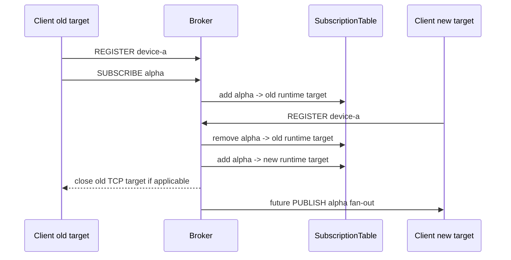

# Stable subscriber identity / reconnect rebinding 정책 설계

- 날짜: 2026-06-22
- 상태: 구현 전 리뷰 대상
- 관련 결정: D053, D058, D059, D060, D067, D075
- 범위: 설계 문서. 코드 구현은 포함하지 않는다.

## 목표

현재 Broker subscription 은 runtime send target 에 묶여 있다.

- TCP: 현재 살아 있는 `IConnection` reference
- UDP: 현재 살아 있는 `(IUdpEndpoint localEndpoint, EndPoint remoteEndPoint)` 조합

이 모델은 v1 동작에는 단순하고 안전하지만, 외부 장비나 애플리케이션을 "같은 logical subscriber"로 계속 추적하지 않는다.
TCP reconnect, UDP remote port 변경, TCP/UDP transport 전환이 일어나면 기존 subscription 은 자동으로 이어지지 않는다.

이번 설계의 목표는 stable subscriber identity 를 바로 구현하는 것이 아니라, 후속 구현이 같은 의미를 공유하도록
identity source, duplicate 처리, reconnect rebinding, 보존 범위, 비범위를 명확히 정하는 것이다.

## 확인된 현재 사실

- `EndpointId`는 Transport snapshot 관측용 transient diagnostics id 이며 stable routing id 가 아니다(D058).
- v1 subscription 은 runtime endpoint 수명에 묶이고 reconnect rebinding 을 제공하지 않는다(D059).
- UDP broker v1은 datagram self-command 와 runtime remote target 을 사용한다(D060).
- `BrokerSubscriber`는 현재 TCP connection reference 또는 UDP endpoint/remote 값을 fan-out target 으로 감싼다.
- `SubscriptionTable`은 topic 별 `BrokerSubscriber` set 을 유지하고, endpoint close 또는 UDP idle sweep 때 runtime target 을 제거한다.
- 현재 wire command 는 `SUBSCRIBE <topic>`, `UNSUBSCRIBE <topic>`, `PUBLISH <topic> <payload>`뿐이다.

따라서 stable identity 는 기존 `EndpointId`나 socket handle 에서 추론하지 않고, Broker/Server 계층의 별도 opt-in 모델로
추가해야 한다.

## 접근 후보

### 후보 A — 현재 runtime target 모델 유지

가장 작고 안전하다. 모든 reconnect client 는 다시 `SUBSCRIBE` 한다.

장점:
- 코드 변경이 없다.
- hijack, duplicate, stale identity retention 을 결정하지 않아도 된다.
- 현재 drop-oldest 최신 상태 fan-out 정책과 충돌하지 않는다.

단점:
- 장비/endpoint 단위 운영 관측과 reconnect 편의성을 제공하지 못한다.
- TCP/UDP transport 변경을 같은 subscriber 로 묶을 수 없다.

### 후보 B — wire command 기반 stable identity

client 가 `REGISTER <subscriber-id>` command 로 logical identity 를 명시한다.
등록 뒤 `SUBSCRIBE`는 runtime target 이 아니라 registered identity 의 topic set 으로 기록된다.

장점:
- TCP/UDP self-command 모델과 맞고, 외부 client 가 스스로 identity 를 선언할 수 있다.
- reconnect 시 새 runtime target 이 같은 identity 를 다시 등록하면 subscription 을 재바인딩할 수 있다.
- server configuration 없이도 integration test 와 sample 을 만들기 쉽다.

단점:
- 인증이 없으면 같은 id 를 보낸 다른 client 가 identity 를 탈취할 수 있다.
- duplicate id 처리, old target close, UDP stale target 정리 정책이 필요하다.

### 후보 C — server configuration / host API 기반 stable identity

Server host 가 미리 `subscriber-id -> allowed target` 또는 adapter binding 을 제공한다.
wire command 는 identity 를 직접 만들지 않고, Transport/remote 정보 또는 host API 가 identity 를 해석한다.

장점:
- 무인증 wire hijack 위험을 줄일 수 있다.
- 운영자가 아는 endpoint registry 와 diagnostics 이름을 맞추기 좋다.

단점:
- TCP remote address, UDP NAT/port 변경만으로 stable identity 를 판정하기 어렵다.
- host configuration surface 가 먼저 커지고, 현재 sample/benchmark 경로보다 구현 범위가 넓다.

## 결정

후속 stable identity 는 **후보 B를 최소 구현 경로로 채택하되, 기본 v1 runtime target 모델은 유지한다**.

즉 stable identity 는 opt-in 기능이다. `REGISTER`를 사용하지 않는 기존 TCP/UDP client 는 지금처럼 runtime target 수명에 묶인다.
`REGISTER <subscriber-id>`를 보낸 client 만 stable identity registry 에 들어가고, 해당 identity 의 topic set 과 current target 을
Broker 가 관리한다.

후보 C의 configuration resolver 는 production hardening 후보로 남긴다. 인증/권한이 없는 상태에서 wire identity 를 넓게 신뢰하면
탈취 위험이 있으므로, stable identity 기능은 "신뢰된 네트워크 또는 테스트/내부 host"라는 전제를 문서화하고, 외부 노출 전에는
configuration resolver 또는 인증 설계를 별도로 요구한다.

## identity 모델

### SubscriberIdentity

`SubscriberIdentity`는 Broker 계층의 stable logical subscriber id 이다.

- 문자열 기반 ASCII token 으로 시작한다.
- 공백을 허용하지 않는다.
- 비교는 `StringComparer.Ordinal` 기준이다.
- `EndpointId`와 변환하지 않는다.
- TCP/UDP 공통 namespace 를 사용한다.

TCP/UDP 공통 namespace 를 쓰는 이유는 같은 장비가 transport 를 바꿔도 같은 logical subscriber 로 다룰 수 있게 하기 위해서다.
반대로 TCP와 UDP를 항상 별도 logical endpoint 로 다뤄야 하는 시스템은 id 자체를 `device-a/tcp`, `device-a/udp`처럼 분리하면 된다.

### runtime target

stable identity 는 직접 socket send 를 수행하지 않는다. 실제 fan-out 은 여전히 runtime `BrokerSubscriber` target 으로 보낸다.

- TCP target: `BrokerSubscriber.ForTcp(IConnection)`
- UDP target: `BrokerSubscriber.ForUdp(IUdpEndpoint, EndPoint)`

identity registry 는 `SubscriberIdentity -> current BrokerSubscriber? + topic set + generation`을 가진다.
publish 시 `SubscriptionTable`에는 현재 online target 만 들어가므로 disconnected identity 로 fan-out 을 시도하지 않는다.

## command 정책

후속 wire command 는 다음처럼 확장한다.

- `REGISTER <subscriber-id>`
- `UNREGISTER <subscriber-id>`
- 기존 `SUBSCRIBE <topic>`
- 기존 `UNSUBSCRIBE <topic>`
- 기존 `PUBLISH <topic> <payload>`

등록된 target 에서 들어온 `SUBSCRIBE <topic>`은 해당 target 이 아니라 registered identity 의 topic set 에 기록한다.
등록되지 않은 target 의 `SUBSCRIBE <topic>`은 기존 runtime subscription 으로 처리한다.

등록된 target 에서 들어온 `UNSUBSCRIBE <topic>`은 identity topic set 에서 제거하고, 현재 online target 도 routing table 에서 제거한다.
`UNREGISTER <subscriber-id>`는 identity 의 모든 topic subscription 을 제거하고 current target binding 을 해제한다.

`REGISTER`는 publish payload 를 만들지 않으므로 `RefCountedBuffer` fan-out 소유권 규칙을 바꾸지 않는다.

## reconnect rebinding 정책

같은 `subscriber-id`가 새 runtime target 에서 다시 `REGISTER`되면 **새 registration 이 이긴다**.

처리 순서는 다음이다.

1. identity registry lock 을 잡는다.
2. 기존 current target 이 있으면 `SubscriptionTable`의 해당 identity topic set 에서 old runtime target 을 제거한다.
3. 새 runtime target 을 current target 으로 저장하고 generation 을 증가시킨다.
4. identity topic set 의 모든 topic 에 새 runtime target 을 추가한다.
5. old target 이 TCP connection 이면 lock 밖에서 `Close()`를 호출한다.
6. old target 이 UDP remote 이면 별도 close 는 없고 routing 에서만 제거한다.

이 정책은 reconnect 와 duplicate registration 을 같은 모델로 처리한다. 동시에 두 target 이 같은 identity 로 fan-out 을 받지 않게
하므로 split-brain delivery 를 피한다.

같은 runtime target 이 같은 id 를 다시 `REGISTER`하면 idempotent 로 처리한다.
같은 runtime target 이 다른 id 로 `REGISTER`하면 protocol error 로 본다.

- TCP: malformed command 와 같은 정책으로 connection 을 닫고 cleanup 한다.
- UDP: 해당 datagram 만 폐기한다. shared UDP endpoint 전체를 닫지 않는다.

## disconnect 보존 정책

stable identity 는 **subscription metadata 만 보존**한다.

- disconnected 동안 들어온 publish payload 를 저장하지 않는다.
- reconnect 이후 새 publish 부터 다시 fan-out 한다.
- durable history, replay, reliable delivery 는 범위 밖이다.

TCP connection close 또는 UDP idle sweep 으로 current target 이 사라지면:

1. runtime target 을 `SubscriptionTable`에서 제거한다.
2. identity topic set 은 registry 에 남긴다.
3. current target 은 `null`로 바꾼다.
4. identity retention timeout 또는 explicit `UNREGISTER`로 registry entry 를 제거한다.

무한 증가를 막기 위해 stable identity registry 는 retention 정책이 필요하다.
첫 구현에서는 `BrokerServerOptions`에 기본 enabled 값을 추가하지 않는다. stable identity 기능을 켜는 옵션에서
`IdentityRetentionTimeout`을 명시하도록 한다. timeout 이 지나면 disconnected identity 와 topic set 을 제거한다.

## 계층 경계

Transport 계층은 stable identity 를 모른다.

- `EndpointId`, `EndpointSnapshot`, send diagnostics 는 그대로 transient 관측값이다.
- `IConnection`, `IUdpEndpoint`, `ITransport` public 계약은 이 설계만으로 넓히지 않는다.

Protocol 계층은 `REGISTER`/`UNREGISTER` command decode 만 담당한다.

- command decoder 는 token span view 를 제공한다.
- identity token 을 장기 보관해야 하는 Broker/registry 계층에서 string 으로 복사한다.

Broker 계층은 stable identity registry 를 소유한다.

- `SubscriberIdentity`
- `SubscriberRegistry`
- identity topic set
- runtime target rebind
- target close/idle sweep cleanup coordination

Server 계층은 feature option 과 timer 를 조립한다.

- 기본 disabled
- retention sweep timer 는 UDP lease sweep 과 별도 timer 또는 공통 host timer helper 로 묶을 수 있다.
- 단, 첫 구현 단위에서는 timer abstraction 을 과하게 일반화하지 않는다.

## 예상 데이터 흐름

## 테스트 방향

구현은 작은 단위로 나눈다.

1. Protocol command Red/Green
   - `REGISTER <id>`와 `UNREGISTER <id>` decode 를 추가한다.
   - identity token 에 공백이 있으면 invalid 로 처리한다.

2. Broker identity registry pure unit
   - 같은 id 재등록 시 old target 제거, new target 추가, generation 증가를 검증한다.
   - 같은 target 같은 id 재등록은 idempotent 를 검증한다.
   - 같은 target 다른 id 등록은 reject 를 검증한다.

3. TCP handler integration
   - `REGISTER` 뒤 `SUBSCRIBE`한 connection 이 close 되면 runtime target 은 제거되지만 identity topic set 은 retention 대상이 된다.
   - 같은 id 새 connection 이 `REGISTER`하면 기존 topic 이 새 connection 으로 fan-out 된다.

4. UDP handler integration
   - 같은 id 새 remote 가 `REGISTER`하면 old remote target 은 routing 에서 제거되고 새 remote 가 fan-out 대상이 된다.
   - malformed/invalid UDP identity command 는 datagram 만 폐기한다.

5. retention sweep
   - disconnected identity 가 timeout 뒤 제거된다.
   - online identity 는 sweep 대상이 아니다.

각 테스트에는 어떤 불변식과 회귀를 막는지 한국어 주석을 둔다.

## 구현하지 않는 범위

- `EndpointId`를 stable routing key 로 승격
- disconnected 기간의 message buffering/replay
- reliable delivery, durable history
- 인증, 권한, TLS
- DDS discovery/RTPS 호환
- topic/data type 별 QoS
- config resolver 기반 identity verification
- cluster 또는 process restart 이후 identity persistence

## 다음 작업 제안

이 설계가 승인되면 바로 전체 구현으로 가지 말고, 먼저 구현 계획을 작성한다.
첫 코드 단위는 `REGISTER`/`UNREGISTER` protocol decode 로 제한하는 것이 가장 작고 검증 가능하다.

그 다음에 Broker pure registry 를 추가하고, TCP/UDP handler integration 은 별도 커밋으로 나눈다.
retention timer 는 registry semantics 가 검증된 뒤 마지막 단위로 붙인다.
