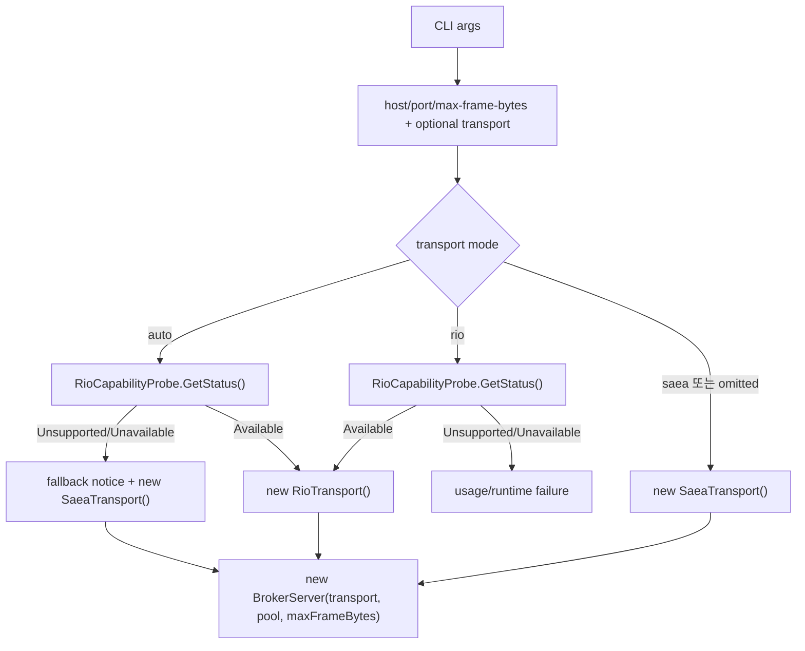

# 2026-06-26 Host Composition Transport Selection Policy 설계

## 목표

D119로 base `TransportFactory.CreateDefault()`는 계속 SAEA default 를 반환하기로 했다.
이번 설계의 목표는 RIO를 default factory 에 넣지 않으면서도 실제 실행 host 에서 RIO preferred/auto 선택을 제공할지 결정하는 것이다.

현재 실행 가능한 host 는 `samples/Hps.Sample.BrokerServer`이고, benchmark 는 이미 `--backend saea|rio` selector 를 갖고 있다.
따라서 selection policy 는 library core 가 아니라 host composition 경계에 두는 것이 자연스럽다.

## 현재 구조

- `BrokerServer`는 생성자에서 `ITransport`를 받는다.
  - Server library 는 concrete backend 를 알지 않는다.
  - TCP/UDP start 는 주입된 transport 에만 위임한다.
- `samples/Hps.Sample.BrokerServer`는 현재 `TransportFactory.CreateDefault()`로 SAEA를 만든다.
  - sample project 는 `Hps.Transport.Rio`를 참조하지 않는다.
  - CLI는 `<host> <port> <max-frame-bytes>` 3개 positional argument 만 받는다.
- benchmark project 는 `Hps.Transport.Rio`를 참조하고 `--backend saea|rio`를 explicit selector 로 사용한다.
  - explicit `--backend rio`는 RIO unavailable 시 SAEA로 fallback 하지 않는다.
  - 이 성격은 성능 측정 artifact 를 오염시키지 않기 위해 유지해야 한다.

## 선택지

### A. `Hps.Server`에 transport selector API를 추가한다

채택하지 않는다.

이 방식은 `Hps.Server`가 RIO assembly 를 참조해야 하거나, reflection/provider registration 을 받아야 한다.
Server library 는 지금 Broker orchestration 에 집중하고 있고, backend 선택은 생성자 밖에서 이미 해결할 수 있다.
RIO preferred policy 때문에 Server library 의 의존성이 backend 로 넓어지는 것은 D119의 경계와 맞지 않는다.

### B. `samples/Hps.Sample.BrokerServer`에 host-level selector 를 추가한다

채택한다.

sample broker host 는 실행 composition 계층이다.
여기서 `Hps.Transport.Rio`를 참조하고 `--transport saea|rio|auto`를 해석해 concrete `ITransport`를 만드는 것은 의존 방향을 깨지 않는다.
사용자는 실제 실행 때 RIO를 명시 opt-in 할 수 있고, 기존 library 사용자와 tests 는 영향을 받지 않는다.

### C. 별도 `Hps.Transport.Selection` package 를 만든다

지금은 채택하지 않는다.

장기적으로 SAEA/RIO/io_uring 까지 모두 조합하는 package 가 필요해질 수 있다.
하지만 현재 io_uring backend 는 비어 있고, 실제 host 도 sample broker server 하나뿐이다.
지금 별도 package 를 만들면 API surface 와 project 수가 먼저 늘어난다.

## 결정

다음 정책을 D120으로 기록한다.

- RIO preferred/default selection 은 host composition 책임이다.
- 첫 적용 대상은 `samples/Hps.Sample.BrokerServer`다.
- `Hps.Server`와 base `Hps.Transport.TransportFactory.CreateDefault()`는 변경하지 않는다.
- sample broker server 는 기존 positional arguments 를 유지하고 optional `--transport <saea|rio|auto>`를 추가한다.
- 기본값은 `saea`다.
  - 기존 실행과 같은 backend 를 유지한다.
  - default 변경으로 RIO unavailable/fallback semantics 가 암묵적으로 들어오지 않는다.
- `--transport rio`는 explicit RIO 선택이다.
  - Windows RIO unavailable 또는 unsupported OS 에서는 실패 exit code 로 종료한다.
  - SAEA fallback 하지 않는다.
- `--transport auto`는 preferred policy 다.
  - RIO available 이면 RIO를 사용한다.
  - RIO unsupported/unavailable 이면 SAEA로 fallback 한다.
  - fallback 은 stderr 또는 startup output 에 명시해 관측 가능하게 한다.

## CLI shape

기존:

```text
Hps.Sample.BrokerServer <host> <port> <max-frame-bytes>
```

확장:

```text
Hps.Sample.BrokerServer <host> <port> <max-frame-bytes> [--transport <saea|rio|auto>]
```

`--transport`는 optional named option 으로 둔다.
positional 3개를 유지해 기존 명령을 깨지 않는다.

## 생성 흐름



## 오류와 관측성

- 알 수 없는 transport 값은 usage error 로 처리한다.
- `--transport` 값이 빠지면 usage error 로 처리한다.
- `--transport rio`에서 RIO unavailable 이면 broker 를 시작하지 않고 실패한다.
  - exit code 는 invalid argument `2`와 구분해 runtime failure `1`을 사용한다.
- `--transport auto` fallback 은 stderr 또는 startup output 에 다음 정보를 남긴다.
  - requested mode: auto
  - selected backend: SAEA
  - RIO capability status: unsupported/unavailable
- startup success output 에 selected backend 를 포함한다.

## 구현 경계

포함:

- sample broker server CLI parser 확장.
- sample broker server project 에 `Hps.Transport.Rio` 참조 추가.
- sample 내부 `SampleTransportSelection` enum 또는 작은 parser helper.
- 선택된 backend 이름을 startup output 에 기록.
- parser/selection 정책 unit test. sample test project 가 없다면 작은 test project 추가를 검토한다.

제외:

- `TransportFactory.CreateDefault()` 변경.
- `Hps.Server` public options 에 transport selection 추가.
- reflection 기반 RIO loading.
- benchmark `--backend` semantics 변경.
- production-grade config file/env var policy.
- io_uring selection.

## 테스트 전략

- parser:
  - optional `--transport`가 없으면 SAEA mode 로 해석된다.
  - `saea`, `rio`, `auto`를 case-insensitive 로 받는다.
  - 값 누락과 unknown value 는 usage error 로 처리한다.
- selection:
  - `saea`는 capability probe 없이 SAEA를 선택한다.
  - `rio`는 available 일 때 RIO를 선택하고 unavailable 일 때 실패한다.
  - `auto`는 available 일 때 RIO, unavailable/unsupported 일 때 SAEA fallback 을 선택한다.
- integration smoke:
  - 기존 3개 positional argument usage 는 여전히 유효해야 한다.
  - RIO unavailable 환경에서도 `--transport auto`가 SAEA로 시작 가능한 경로를 테스트 가능한 형태로 둔다.

## 후속 구현 계획 후보

1. sample CLI parser/selection model 을 순수 함수로 분리한다.
2. RIO capability 상태를 주입 가능한 delegate 로 감싸 selection tests 가 실제 OS/RIO availability 에 의존하지 않게 한다.
3. `Program.Main`에서 selection result 로 concrete transport 를 생성한다.
4. usage/startup output 을 갱신하고 smoke tests 를 추가한다.

## 완료 기준

- host composition 경계에서 RIO preferred 선택을 제공할 수 있는 최소 API shape 가 정해진다.
- explicit RIO와 auto fallback semantics 가 분리된다.
- base `TransportFactory.CreateDefault()`와 `Hps.Server` library surface 가 영향을 받지 않는다는 점이 문서화된다.
- 다음 implementation plan 은 sample CLI parser/selection tests 부터 Red-Green 으로 시작할 수 있다.
