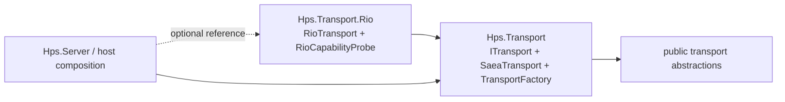

# 2026-06-26 RIO Default Selection Policy After UDP Gate

## 목표

D118로 RIO UDP 4096B x 100Hz load/open-loop scratch gate 가 닫혔다.
이번 설계의 목표는 이 결과를 근거로 `TransportFactory.CreateDefault()`를 바로 바꿀지, 아니면
default/fallback policy 를 별도 composition 경계로 둘지 결정하는 것이다.

## 현재 확인한 사실

- `TransportFactory.CreateDefault()`는 `Hps.Transport` assembly 안에 있으며 현재 `new SaeaTransport()`를 반환한다.
- `RioTransport`는 별도 `Hps.Transport.Rio` assembly 에 있다.
- `Hps.Transport.Rio`는 `Hps.Transport`를 참조하지만, 반대로 `Hps.Transport`가 `Hps.Transport.Rio`를 참조하면 backend 의존 방향이 뒤집힌다.
- `RioCapabilityProbe.GetStatus()`는 Windows가 아니면 `UnsupportedOperatingSystem`, Windows에서 function table load 실패 시 `Unavailable`, 성공 시 `Available`을 반환한다.
- explicit RIO benchmark `--backend rio`는 unavailable 시 SAEA fallback 으로 바뀌지 않는다.
- `BrokerServer`는 외부에서 주입한 `ITransport`를 사용할 수 있으므로 host/composition layer 에서 RIO opt-in 이 가능하다.
- D118 기준 RIO UDP scratch gate:
  - load: sent/received 3000/3000, p99 831.8 us.
  - open-loop: sent/received 3000/3000, p99 889.4 us.

## 구조 제약

`TransportFactory.CreateDefault()`가 base assembly 에 남아 있는 한, 이 factory 가 `RioTransport`를 직접 생성하려면
`Hps.Transport`가 `Hps.Transport.Rio`를 참조해야 한다. 이는 OS별 backend 를 `ITransport` 뒤에 숨기는 현재 계층 경계와 맞지 않는다.

reflection 으로 RIO assembly 를 찾아 생성하는 우회도 가능하지만, 이 프로젝트는 이미 reflection 기반 runtime dispatch 를 줄이는 방향으로 정리되고 있다.
default path 에 reflection loading 이 들어가면 실패 원인과 배포 누락을 숨기기 쉽다.

## 선택지

### A. 지금 `CreateDefault()`를 Windows+RIO available 이면 RIO로 바꾼다

채택하지 않는다.

이유:

- base `Hps.Transport`가 backend `Hps.Transport.Rio`를 참조해야 하므로 의존 방향이 깨진다.
- RIO unavailable fallback 과 assembly load failure 가 default path 의 책임이 된다.
- 기본 backend behavior 가 platform 별로 달라져 기존 contract test 의미가 흔들린다.
- explicit benchmark 와 production default fallback semantics 가 섞일 수 있다.

### B. `CreateDefault()`가 reflection 으로 RIO를 찾아 있으면 사용한다

채택하지 않는다.

이유:

- 배포 누락, version mismatch, type load failure 가 runtime default path 에 숨어 들어간다.
- 실패 시 SAEA fallback 을 하더라도 관측성과 재현성이 약해진다.
- default factory 가 hot path 는 아니지만 composition 실패 원인을 숨기는 방향은 운영에 좋지 않다.

### C. base default 는 SAEA로 유지하고, RIO preferred policy 는 composition layer 로 둔다

채택한다.

정책:

- `TransportFactory.CreateDefault()`는 계속 deterministic cross-platform SAEA default 다.
- explicit RIO path 는 계속 `new RioTransport()` 또는 benchmark `--backend rio`처럼 opt-in 이며 unavailable 시 실패한다.
- future preferred policy 는 `Hps.Transport` base assembly 가 아니라 RIO를 참조하는 composition layer 에 둔다.
- preferred policy 가 생기면 fallback 은 다음 규칙에 따른다.
  - Windows + RIO available + operator 가 preferred policy 를 선택한 경우 RIO를 사용한다.
  - RIO unavailable 또는 non-Windows 이면 SAEA로 fallback 한다.
  - fallback event 는 diagnostics/log/startup report 로 관측 가능해야 한다.
  - benchmark explicit RIO는 fallback 하지 않는다.

## 결정

다음 상태를 D119로 기록한다.

- `TransportFactory.CreateDefault()`는 계속 SAEA를 반환한다.
- RIO는 D118 이후에도 automatic default 가 아니라 explicit opt-in backend 다.
- RIO preferred fallback 은 base factory 가 아니라 composition layer 또는 별도 selector API에서 설계한다.
- reflection 기반 default RIO loading 은 채택하지 않는다.
- 다음 구현 후보는 코드 변경이 아니라 host/composition selection API 설계다.

## 후속 구현 후보

### 후보 1: `Hps.Server` 또는 sample host level selector

서버/샘플 host 가 RIO assembly 를 참조하고, 명시 option 으로 RIO preferred 를 선택한다.

장점:

- base transport dependency 를 깨지 않는다.
- Interface Server 실행 host 의 실제 deployment 정책과 맞다.

단점:

- library-only 사용자는 사전에 직접 backend 를 선택해야 한다.

### 후보 2: 별도 selector package

`Hps.Transport.Selection` 같은 별도 composition package 를 만들고, 이 package 가 SAEA/RIO/io_uring 후보를 조합한다.

장점:

- base abstraction 과 backend implementation 의 의존 방향을 유지한다.
- 향후 Linux io_uring 까지 selection policy 를 한 곳에 둘 수 있다.

단점:

- 새 project/package 가 필요하다.
- 지금은 io_uring backend 가 비어 있어 과한 구조가 될 수 있다.

### 후보 3: base factory registration API

base `TransportFactory`에 provider registration 을 두고, RIO assembly 가 startup 에 provider 를 등록한다.

장점:

- `CreateDefault()` 이름을 유지하면서 plugin-like selection 이 가능하다.

단점:

- global mutable registration 이 생긴다.
- test isolation, app startup ordering, duplicate registration 정책이 필요하다.
- 현재 규모에는 과하다.

## 권장 다음 작업

즉시 `CreateDefault()`를 바꾸지 않는다.
다음 작업은 **host/composition selection policy 설계**로 둔다.

가장 작은 다음 설계 단위:

- `BrokerServer` sample 또는 future host 가 `--transport saea|rio|auto` 같은 option 을 가질지 결정한다.
- `auto`의 fallback 관측성을 어떻게 남길지 정한다.
- library `TransportFactory.CreateDefault()`와 host-level default 를 분리해 문서화한다.

## 완료 기준

- `TransportFactory.CreateDefault()`가 SAEA를 유지하는 이유가 D118 이후에도 문서화된다.
- RIO unavailable fallback 이 explicit RIO benchmark 를 오염시키지 않는다는 정책이 유지된다.
- future preferred selection 이 어느 assembly/layer 에 있어야 하는지 결정된다.
- 다음 implementation plan 은 API surface, dependency direction, fallback observability 를 포함한다.
