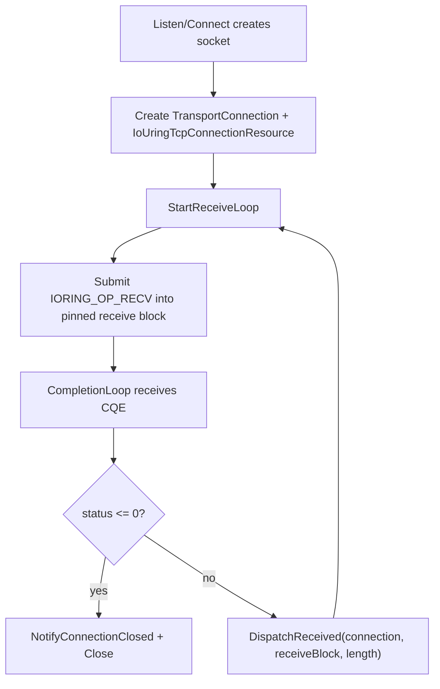
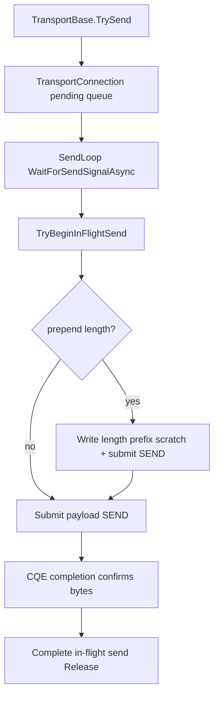

# TCP-first io_uring Queue/Pump 설계

- 날짜: 2026-06-29
- 상태: Draft accepted for implementation planning
- 관련 결정: D133, D134, D135
- 범위: Linux `Hps.Transport.IoUring` TCP listen/connect/receive/send/close data path 설계

## 목표

`Hps.Transport.IoUring`을 skeleton/unsupported boundary 상태에서 TCP-first opt-in backend 로 한 단계 전진시킨다.
첫 목표는 SAEA/RIO와 같은 `ITransport` public 계약을 유지하면서 TCP loopback publish/subscribe 경로가
io_uring receive/send pump 를 통과할 수 있는 구조를 만드는 것이다.

이번 설계는 UDP pump, default backend promotion, Linux benchmark artifact, zero-copy send hardening 을 포함하지 않는다.

## 현재 기반

- `IoUringNative`는 `io_uring_setup`, `io_uring_register`, `mmap`, `munmap`, `close` wrapper 를 가진다.
- `IoUringQueue`는 setup fd 와 SQ/CQ/SQE mmap 수명을 소유한다.
- `IoUringRegisteredBufferSet`은 managed buffer pinning 과 fixed buffer registration 수명을 함께 소유한다.
- `IoUringTransport`는 lifecycle shell 과 unsupported boundary 만 가진다.
- 공통 TCP send ownership, drop-oldest, close drain 은 `TransportConnection`이 이미 제공한다.

## 접근 후보

### 선택안 A — Transport당 shared io_uring queue + reusable operation context

`IoUringTransport`가 하나의 shared `IoUringQueue`와 completion pump 를 소유한다. 각 TCP connection 은 receive/send operation context 를
소유하고, SQE `user_data`에는 context token 을 넣는다. completion pump 는 CQE `user_data`로 context 를 찾아 완료를 통지한다.

장점:
- C10K 방향에서 fd/mmap/ring 수가 connection 수에 비례해 폭증하지 않는다.
- `TransportConnection` pending send queue 를 그대로 재사용할 수 있다.
- 후속 UDP, batching, fixed buffer registry 로 확장하기 쉽다.

단점:
- completion routing, operation lifetime, close/drain 직렬화가 per-connection ring 보다 복잡하다.

판단: 채택한다. 복잡도는 `IoUringOperationRegistry`와 `IoUringCompletionLoop`로 분리해 관리한다.

### 대안 B — Connection당 io_uring queue

각 TCP connection 이 자체 `IoUringQueue`를 가진다. completion mapping 은 단순하지만 connection 수만큼 ring fd/mmap이 생긴다.

판단: 기각한다. C10K 목표와 맞지 않고, ring 리소스 수명/메모리 사용량이 너무 커진다.

### 대안 C — Socket control/data plane 유지 + io_uring wrapper만 보존

TCP listen/connect/receive/send 를 기존 Socket API로 계속 수행하고 io_uring은 capability probe 에만 둔다.

판단: 기각한다. implementation risk 는 낮지만 Phase 6의 backend 실효성이 생기지 않는다.

## 선택 설계

### 책임 경계

- `IoUringTransport`
  - `StartAsync`에서 capability 를 확인하고 shared queue/completion loop 를 연다.
  - TCP listener/connection 목록을 추적하고 `StopAsync`에서 닫는다.
  - `TransportConnection`을 생성해 공통 send queue/diagnostics 를 재사용한다.

- `IoUringConnectionListener`
  - 첫 단계에서는 .NET `Socket`으로 bind/listen/accept control plane 을 처리한다.
  - accept 된 socket 을 `IoUringTransport.CreateAcceptedConnection(...)`으로 넘긴다.
  - 이유: RIO도 control plane 은 Socket accept/connect 를 사용하고, io_uring data plane 검증을 먼저 닫는 것이 최소 단위다.

- `IoUringTcpConnectionResource`
  - socket fd, receive block, length-prefix block, receive/send operation context, close gate 를 소유한다.
  - receive block 은 `PinnedBlockMemoryPool`에서 1개 rent 한다.
  - length-prefix block 은 connection lifetime pinned 4-byte scratch 로 둔다.
  - payload send 는 초기 TCP-first pump 에서는 `RefCountedBuffer`의 pinned array view 를 직접 `SEND`에 넘긴다.
    fixed payload registration cache 는 후속 최적화로 남긴다.

- `IoUringCompletionLoop`
  - shared queue 의 SQ submit 과 CQ drain 을 담당한다.
  - submit path 는 단일 lock 으로 SQ tail/SQE 접근을 직렬화한다.
  - completion path 는 CQE `user_data`로 `IoUringOperationContext`를 찾아 완료한다.

- `IoUringOperationContext`
  - connection당 receive/send context 를 재사용한다.
  - context token 은 resource lifetime 동안 고정한다.
  - completion 전까지 buffer owner 또는 in-flight send owner 를 살아 있게 유지한다.

### TCP Receive 흐름

receive handler 예외는 SAEA/RIO와 같이 connection close notification 으로 수렴한다. handler 가 반환된 뒤에만 같은 receive block 을
재사용하므로 borrowed `TransportReceiveBuffer` 수명 계약을 유지한다.

### TCP Send 흐름

partial send 는 remaining byte 범위를 갱신하며 반복 submit 한다. `TransportConnection.InFlightSend`는 CQE 완료 또는 unwind 경로에서
정확히 1회 Release 된다.

### Fixed buffer 사용 경계

`IoUringRegisteredBufferSet`은 바로 TCP pump 에 강제 연결하지 않는다. shared ring 에 fixed buffer table 을 한 번 등록해야 하므로,
per-connection buffer 를 즉시 개별 등록/해제하는 방식은 피한다. 초기 TCP pump 는 pinned receive block 과 pinned payload array 를
일반 `RECV`/`SEND`에 넘긴다.

후속 최적화에서 `IoUringFixedBufferRegistry`를 설계해 transport-wide registered slab 또는 bounded connection-local lease 를 선택한다.
이렇게 해야 ring-wide registration table 과 `PinnedBlockMemoryPool` 반환 규칙이 충돌하지 않는다.

## 오류 및 종료 정책

- capability 가 `Available`이 아니면 explicit `IoUringTransport` TCP listen/connect 는 `NotSupportedException`으로 실패한다.
- `StopAsync`는 listener, connection, completion loop 순으로 닫는다.
- connection close 는 먼저 `TransportConnection.Close()`를 통해 pending/in-flight ownership 을 정리하고, resource dispose 로 socket/operation context 를 닫는다.
- CQE status < 0, 0-byte receive, socket dispose, handler exception 은 모두 `NotifyConnectionClosed(connection)`으로 수렴한다.
- completion loop 내부 예외는 transport-wide stop 으로 번지지 않고 해당 operation owner 를 close 한다.

## 테스트 전략

- Windows/non-Linux:
  - type/contract shape 는 reflection assertion Red 로 고정한다.
  - explicit io_uring TCP listen/connect 는 계속 `NotSupportedException` boundary 를 검증한다.
  - `TransportFactory.CreateDefault()`는 계속 `SaeaTransport`를 반환한다.
  - operation registry, completion routing, close idempotency 는 pure unit test 로 검증한다.

- Linux:
  - `IoUringCapabilityProbe.GetStatus() == Available`일 때만 loopback integration 을 실행한다.
  - TCP small payload, length-prefixed payload, large payload, repeated close after accept 를 검증한다.
  - pool `RentedCount == 0`으로 receive/send ownership leak 를 확인한다.

## 범위 밖

- UDP io_uring endpoint
- `IORING_REGISTER_BUFFERS_UPDATE` 또는 payload registration cache
- `SEND_ZC`, `MSG_ZEROCOPY`, fixed file registration
- shared ring batching/polling budget 튜닝
- default backend promotion
- CI Linux runner 또는 Linux benchmark artifact 채택

## 다음 구현 계획 방향

1. SQE/CQE/`io_uring_enter` ABI shape 와 operation registry 를 먼저 TDD로 고정한다.
2. completion loop 를 pure/shape 중심으로 분리한다.
3. TCP resource/listener/transport wiring 을 non-Linux boundary test 와 Linux-only loopback test 로 연결한다.
4. send/receive ownership leak 와 close/drain hardening 을 별도 task 로 닫는다.
