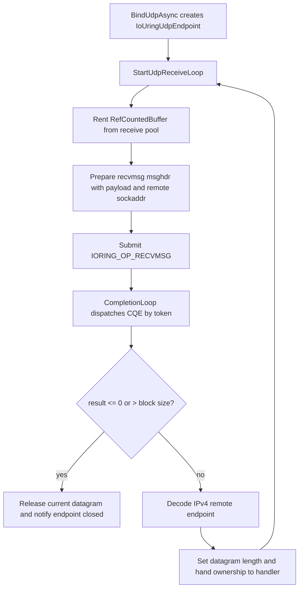
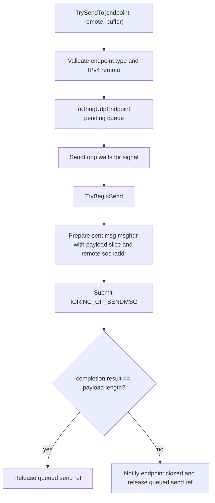

# io_uring UDP Pump 설계

- 날짜: 2026-06-30
- 상태: Draft accepted for implementation planning
- 관련 결정: D135, D137, D139
- 범위: Linux `Hps.Transport.IoUring` UDP bind/receive/send data path 설계

## 목표

D139로 TCP receive/send pump 가 Linux available runner 에서 실제 io_uring 경로를 통과했다. 다음 단계는
`Hps.Transport.IoUring`에 UDP endpoint 를 추가해 `ITransport.BindUdpAsync`와 `TrySendTo`가 opt-in backend 에서도
동작하게 만드는 것이다.

이번 설계는 UDP datagram pump 자체만 다룬다. fixed payload registration cache, `SEND_ZC`, default backend promotion,
CI hard gate, UDP reliability/ordering/congestion control 은 포함하지 않는다.

## 현재 기반

- `IoUringTransport`는 transport-wide `IoUringQueue`, `IoUringOperationRegistry`, `IoUringCompletionLoop`를 갖는다.
- TCP pump 는 connection별 reusable operation context 로 `RECV`/`SEND` completion 을 라우팅한다.
- SAEA UDP 는 one-deep receive loop 와 endpoint 단위 pending send queue 를 사용한다.
- RIO UDP 는 receive window hardening 이후 bounded receive slots 를 갖지만, RIO 전용 request queue/remote address model 에 묶여 있다.
- UDP public contract 는 `IUdpEndpoint`와 `ITransportDatagramHandler`이며, received datagram 은 `RefCountedBuffer` ownership 을 handler 에 넘긴다.

## 후보 비교

### 후보 A: IPv4 one-deep `recvmsg`/`sendmsg` pump

`IoUringUdpEndpoint`가 socket, receive pool, pinned `msghdr`/`iovec`/sockaddr scratch, receive/send operation context,
pending send queue 를 소유한다. receive loop 는 한 번에 하나의 `recvmsg`만 outstanding 으로 두고, completion 후 handler 에
datagram ownership 을 넘긴 뒤 다음 receive 를 post 한다.

장점:

- SAEA UDP와 가장 가까운 lifecycle 이라 첫 io_uring UDP 결함 위치가 좁다.
- TCP pump 의 registry/completion loop 재사용 경계와 일관된다.
- fixed registration/receive window 최적화를 넣지 않아 native `recvmsg`/`sendmsg` ABI 검증에 집중할 수 있다.

단점:

- handler 가 오래 막히면 RIO bounded receive window 만큼 datagram absorption 이 좋지 않다.
- 첫 버전은 IPv4만 지원하므로 IPv6 endpoint 는 explicit unsupported/fallback 정책이 필요하다.

판단: 채택한다. D139 직후 첫 UDP 구현은 native datagram ABI와 ownership 경계를 안정화하는 것이 우선이다.

### 후보 B: 처음부터 bounded receive window 적용

RIO UDP처럼 receive slot 2개 이상을 pre-post 한다.

장점:

- 고빈도 UDP ingress 에서 no-posted-receive window 를 줄일 수 있다.

단점:

- `msghdr`/`iovec`/sockaddr scratch 가 slot 단위로 늘어나고, close/handler exception cleanup 검증이 커진다.
- 첫 io_uring UDP 결함이 native ABI 문제인지 receive window 문제인지 분리하기 어렵다.

판단: 후속 최적화로 분리한다.

### 후보 C: fixed buffer registration 또는 zero-copy send 먼저 적용

`IoUringRegisteredBufferSet` 또는 send zero-copy 계열을 UDP에 먼저 연결한다.

장점:

- 장기 목표인 kernel-copy 최소화 방향과 직접 연결된다.

단점:

- 현재 TCP pump 도 fixed registration cache 없이 통과했다.
- UDP receive ownership 은 `RefCountedBuffer`가 handler/fan-out으로 넘어가므로 등록 buffer lifetime 과 pool return 규칙을 별도 설계해야 한다.
- datagram pump 자체가 없는 상태에서 최적화부터 붙이면 failure mode 가 넓어진다.

판단: 기각한다. UDP pump green 이후 별도 설계로 다룬다.

## 선택 설계

### Native message ABI

UDP는 remote endpoint 를 주고받아야 하므로 `IORING_OP_RECVMSG`와 `IORING_OP_SENDMSG`를 사용한다.
TCP `RECV`/`SEND`와 달리 SQE address 는 payload pointer 가 아니라 pinned `msghdr` pointer 를 가리킨다.

추가 native shape:

- `IoUringNative.OperationReceiveMessage = 10`
- `IoUringNative.OperationSendMessage = 9`
- `IoUringMessageHeader`
  - Linux x64/arm64 `struct msghdr` layout 에 맞춘다.
  - `msg_name`은 pinned sockaddr block 을 가리킨다.
  - `msg_iov`는 pinned `IoUringIovec[]` 첫 요소를 가리킨다.
- `IoUringSockaddr`
  - v1은 IPv4 `IPEndPoint`만 encode/decode 한다.
  - local/remote IPv6는 explicit unsupported/failure 로 처리하고 default selection 은 계속 SAEA fallback 이 담당한다.

### Endpoint resource

새 `IoUringUdpEndpoint`는 `IUdpEndpoint` 구현체이며 다음을 소유한다.

- bound UDP `Socket`
- endpoint id 와 diagnostics snapshot state
- `PinnedBlockMemoryPool` receive pool, block size 8192
- receive operation context 와 send operation context
- receive `IoUringMessageBuffer`
- send `IoUringMessageBuffer`
- endpoint 단위 pending send queue, capacity 16, drop-oldest
- close gate 와 send signal

`IoUringMessageBuffer`는 pinned `IoUringMessageHeader[]`, pinned `IoUringIovec[]`, pinned sockaddr byte block 을
completion 까지 안정적으로 유지한다. payload byte[] 자체는 `PinnedBlockMemoryPool` 또는 `RefCountedBuffer` backing array 이므로
별도 GCHandle 로 다시 pin 하지 않는다. message buffer 는 operation 을 submit 하기 전에 payload pointer, length,
sockaddr pointer, sockaddr length 를 갱신한다.

### Bind

`IoUringTransport.BindUdpAsync`는 다음 순서로 동작한다.

1. `EnsureRunning()`과 `EnsureUdpAvailable()`을 확인한다.
2. local endpoint 가 IPv4 `IPEndPoint`인지 확인한다.
3. `Socket(AddressFamily.InterNetwork, SocketType.Dgram, ProtocolType.Udp)`를 만들고 bind 한다.
4. `IoUringUdpEndpoint`를 생성하고 transport endpoint list 에 등록한다.
5. receive/send loop 를 시작한다.

non-Linux 또는 capability unavailable 이면 기존 TCP와 같은 explicit `NotSupportedException`을 반환한다.

### Receive flow

handler 호출 직전에 `datagram = null`로 transport local ownership 을 비워 SAEA/RIO와 같은 계약을 유지한다.
handler 예외는 endpoint close notification 으로 수렴한다. handler 가 받은 datagram 은 handler 가 release 해야 한다.

### Send flow

`TrySendTo`가 `true`를 반환하면 transport 가 send buffer ref 하나를 소유한다. send completion, drop-oldest, endpoint close 중
정확히 한 경로에서 release 한다. `TrySendTo`가 `false`를 반환하면 caller 가 ref 를 release 한다.

### Close와 cleanup

- `Close()`는 endpoint 를 closed 로 표시하고 socket 을 dispose 한다.
- pending send queue 는 lock 안에서 dequeue 하고 각 buffer 를 release 한다.
- outstanding receive datagram 은 receive loop catch/finally 에서 release 한다.
- operation context 는 endpoint dispose 에서 registry 에서 unregister 한다.
- message buffer 의 GCHandle 은 endpoint resource dispose 에서 해제한다.
- close 후 send signal 을 release 해 send loop 가 drain 후 빠져나오게 한다.

### Diagnostics

UDP pending send queue high-watermark 와 drop count 는 SAEA/RIO와 같은 `TransportBase.RecordUdp...` 경로를 사용한다.
`GetEndpointSnapshots()`는 TCP connections 와 UDP endpoints 를 함께 반환한다. endpoint snapshot state 는 closed/open,
pending count, high-watermark, dropped count 를 포함한다.

## 테스트 전략

- Shape tests:
  - `IoUringSubmissionShapeTests`가 `OperationReceiveMessage`, `OperationSendMessage`, `IoUringMessageHeader`를 확인한다.
  - `IoUringUdpEndpointShapeTests`가 endpoint/resource/message buffer type 과 operation contexts 를 확인한다.
- Non-Linux tests:
  - `BindUdpAsync_WhenNotLinux_ThrowsNotSupportedException`는 유지한다.
  - IPv6 local/remote unsupported boundary 를 Windows에서 reflection/guard 중심으로 고정한다.
- Linux-gated integration:
  - `UdpReceive_WhenIoUringAvailable_DeliversOwnedRefCountedBuffer`
  - `UdpEcho_WhenIoUringAvailable_QueuesResponseAndClientReceivesPayload`
  - `UdpSendTo_WhenIoUringAvailable_SendsSliceAndReleasesRef`
  - `UdpReceive_WhenHandlerThrowsAfterTakingOwnership_ClosesEndpointAndNotifiesHandler`
- Ownership tests:
  - close before pump sends drains queued refs.
  - drop-oldest increments endpoint/transport diagnostics and releases evicted ref.

모든 새 테스트에는 “무엇을 검증하는지”를 한국어 주석으로 남긴다.

## 범위 밖

- IPv6 io_uring UDP direct support
- receive window depth 2 이상
- fixed payload registration cache
- `SEND_ZC`/`MSG_ZEROCOPY`
- default backend promotion
- CI hard gate 또는 benchmark baseline 채택
- UDP reliability, ordering, congestion control

## 다음 구현 계획 방향

1. native message ABI 와 IPv4 sockaddr helper 를 shape/unit test 로 먼저 고정한다.
2. `IoUringUdpEndpoint` resource 와 pending send queue ownership 을 추가한다.
3. `BindUdpAsync`와 receive pump 를 Linux-gated loopback test 로 연결한다.
4. `TrySendTo`와 send pump 를 echo/slice/ownership tests 로 연결한다.
5. state docs 와 D140 decision 으로 UDP v1 boundary 를 기록한다.
