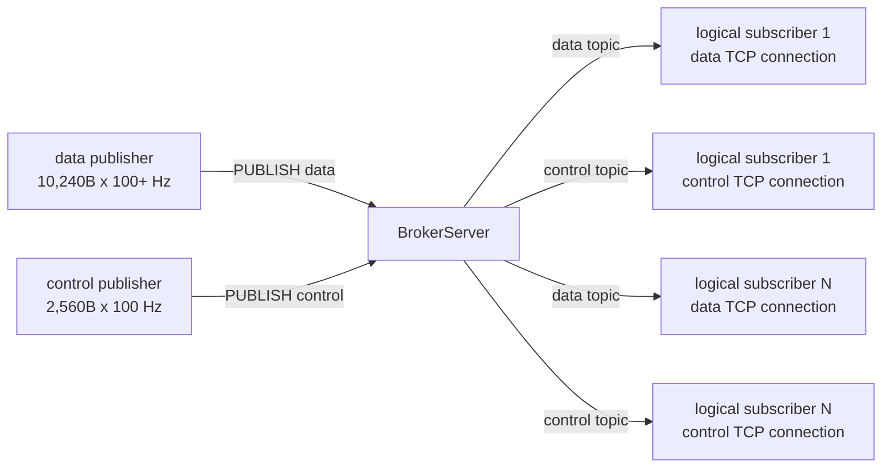

# 혼합 TCP workload 성능 gate 설계

- 날짜: 2026-07-18
- 상태: 구현 및 Windows 수락 완료 - Linux CI restore 범위 교정 push와 io_uring evidence 재실행 대기
- 결정: D243
- 대상: `tests/Hps.Benchmarks`, benchmark CLI/report, 상태 문서
- 구현 계획: `docs/superpowers/plans/2026-07-18-mixed-tcp-workload-gate.md`

## 1. 목적

현재 검증 기준인 `4096B x 100 Hz` 단일 stream은 새 운영 목표를 대표하지 못한다.
새 목표는 다음 두 stream을 동시에 처리하는 Interface Server 경로를 검증하는 것이다.

| stream | payload 대역폭 | 최소 발행률 | 100 Hz 기준 payload | topic |
|---|---:|---:|---:|---|
| 주 데이터 | 8.192 Mbps | 100 Hz | 10,240B | `data` |
| 제어·관제 | 2.048 Mbps | 100 Hz | 2,560B | `control` |

100 Hz에서 두 payload를 합치면 초당 1,280,000B, 즉 10.24 Mbps다.
broker fan-out 송신량은 두 topic을 모두 받는 논리 구독자 수를 `N`이라고 할 때 payload 기준 약 `10.24 x N Mbps`다.

`100 Hz 이상`은 무한한 상한이 아니므로 이 설계에서는 다음처럼 해석한다.

- 기본 수락 profile은 주 데이터 10,240B를 100 Hz로 전송한다.
- `--data-rate-hz`를 높이면 payload 크기는 10,240B로 유지하고 주 데이터 대역폭을 비례해 높인다.
- 이는 고정 8.192 Mbps에서 주기만 높아져 메시지가 작아지는 경우보다 보수적인 검증이다.
- 구현 완료 주장은 기본 100 Hz profile까지만 의미한다. 더 높은 운영 상한은 해당 주파수로 별도 실행해야 한다.

## 2. 현재 사실과 제약

- 기존 `BenchmarkTargets`는 4096B, 100 Hz, subscriber 1명, 30초를 전역 기준으로 사용한다.
- 기존 TCP open-loop runner와 raw report는 단일 stream shape다.
- baseline summary/history/envelope는 단일 `payload-bytes`와 `target-rate-hz`를 비교한다.
- TCP frame assembler는 receive chunk보다 큰 payload를 조립할 수 있다.
- `BrokerServer`의 `maxPayloadLength`와 payload pool block은 frame command envelope 전체를 수용해야 한다.
- 현재 UDP receive block은 backend별로 8192B이므로 10,240B 주 데이터 datagram을 수용하지 못한다.
- 일반 MTU 환경의 10KB UDP datagram은 IP fragmentation 위험도 있으므로 이 목표의 첫 수락 경로로 적합하지 않다.
- TCP connection별 pending send queue는 독립적이지만 같은 connection 안의 topic에는 우선순위가 없다.

따라서 첫 검증은 TCP 전용이며, 주 데이터와 제어·관제를 서로 다른 connection으로 분리한다.

## 3. 범위

### 포함

- 기존 benchmark executable 안의 독립 `--mixed-load-open-loop` command.
- 주 데이터와 제어·관제 publisher의 동시 open-loop 전송.
- 논리 구독자마다 topic별로 분리된 TCP subscriber connection.
- SAEA, RIO, io_uring backend selector 재사용.
- stream별 전달 수, payload 무결성, 순서와 subscriber별 p50/p99/p999 latency.
- transport drop/HWM, 종료 시 pending send 0, payload pool leak 0.
- 실행 전 subscriber 수와 latency 계측 메모리 상한 검증.
- 전용 console/JSON raw report와 명시적 pass/fail.

### 제외

- 기존 4096B baseline 상수, report schema, summary/history/envelope 변경.
- UDP receive block 확대, segmentation/reassembly, 신뢰성 또는 순서 보장.
- production Broker/Protocol/Transport hot path 선행 수정.
- topic priority, ACK/retry, durable queue, consumer group.
- 새 benchmark project, 설정 파일 또는 범용 workload graph engine.
- 실제 NIC/스위치가 포함된 원격 네트워크 인증.

## 4. 검토한 접근

### A. 기존 4096B baseline을 새 목표로 교체

장점은 코드 변경이 작다는 것이다.

하지만 기존 TCP/UDP 비교 이력과 raw schema 의미를 바꾸고, UDP가 10,240B를 수용하지 못해 같은 command의 protocol parity도 깨진다.
기존 증거를 잃으므로 채택하지 않는다.

### B. 기존 단일-stream runner에 workload/profile 분기를 추가

CLI command 수는 늘지 않지만 단일 payload/rate/result 모델에 두 stream을 조건부로 넣어야 한다.
baseline reader, summary, history와 envelope까지 혼합 shape를 이해하게 만들 가능성이 높아 D239의 raw report 경계를 흐린다.
채택하지 않는다.

### C. 독립 mixed TCP command와 raw report 추가 - 채택

기존 baseline은 그대로 유지하고 새 목표만 별도 runner/result/report로 검증한다.
backend 생성, `BrokerServer`, protocol command, diagnostics는 기존 경로를 재사용한다.
설정 파일이나 범용 시나리오 엔진을 만들지 않고 필요한 세 옵션만 제공한다.

## 5. 실행 topology



논리 구독자 한 명은 data/control TCP connection을 각각 하나씩 사용한다.
따라서 publisher 2개와 subscriber `2 x N`개, 총 `2 + 2N`개의 client connection이 열린다.

benchmark harness는 운영 capacity와 별개인 실행 안전 경계로 subscriber를 최대 256명까지 허용한다.
따라서 한 run에서 여는 client connection 상한은 514개다. 더 큰 fan-out을 검증하려면 장비 자원과
목표 수를 확인한 뒤 이 상한을 별도 review 단위에서 조정한다.

이 구조는 다음을 의도한다.

- data와 control이 같은 pending send queue에서 서로를 막지 않는다.
- 각 stream 안의 순서는 TCP connection 순서로 검증한다.
- 두 stream 사이의 전역 순서는 정의하지 않는다.
- 같은 시각에 두 publisher를 시작해 10ms tick이 겹치는 보수적인 burst를 만든다.

## 6. 고정 workload 계약

### data stream

- topic: `data`
- payload: 10,240B
- 기본 rate: 100 Hz
- payload header: big-endian timestamp 8B + sequence 4B + stream marker 1B
- 나머지 payload: sequence 기반 deterministic pattern

### control stream

- topic: `control`
- payload: 2,560B
- rate: 100 Hz 고정
- payload header와 pattern: data stream과 동일한 shape, 별도 stream marker 사용

### frame 상한

- `BrokerServer` payload pool block과 `maxPayloadLength`: 16,384B
- inbound frame payload는 `PUBLISH <topic> ` command envelope와 stream payload를 포함한다.
- 16KiB는 현재 두 고정 stream을 수용하지만 production max frame 의미를 바꾸지 않는 benchmark-local 값이다.

## 7. CLI 계약

```text
Hps.Benchmarks --mixed-load-open-loop \
  [--backend <saea|rio|iouring>] \
  [--data-rate-hz <100 이상>] \
  [--duration-seconds <1 이상>] \
  [--subscribers <1 이상>] \
  [--report <path>]
```

기본값:

- backend: `saea`
- data rate: 100 Hz
- control rate: 100 Hz
- duration: 30초
- subscribers: 1

검증 규칙:

- `--protocol`은 허용하지 않는다. mixed command는 TCP 전용이다.
- data rate가 100 미만이거나 duration/subscribers가 1 미만이면 usage error다.
- subscribers가 benchmark 안전 상한 256을 초과하면 usage error다.
- 계획 메시지 수, 계획 전달 수와 latency 계측 메모리는 64비트 `checked` 계산으로 실행 전에 검증한다.
- latency 원본 배열 전체와 percentile 계산용 재사용 scratch 배열 하나의 payload 합계가 128MiB를 초과하면 usage error다.
- 메모리 추정식은 `(data delivery + control delivery + max(data message, control message)) x sizeof(long)`이다.
- 이 제한은 production capacity 주장이 아니라 benchmark process의 OOM과 과도한 socket 생성을 막는 harness 안전 경계다.
- 기존 `--load-open-loop`, `--baseline-suite`, summary/history/envelope command 의미는 바꾸지 않는다.
- 기존 baseline의 latency report-only 정책도 유지하며 5ms/10ms hard gate는 mixed command에만 적용한다.

30분 soak 예시는 다음과 같다.

```text
Hps.Benchmarks --mixed-load-open-loop --duration-seconds 1800 --subscribers 1 --report mixed-soak.json
```

## 8. Runner 구조와 데이터 흐름

1. 선택 backend로 `ITransport`와 16KiB `PinnedBlockMemoryPool`을 만든다.
2. `BrokerServer`를 TCP loopback endpoint에서 시작한다.
3. data/control subscriber connection을 논리 구독자 수만큼 각각 만들고 topic을 구독한다.
4. `WaitForSubscriberCountAsync`로 두 topic 모두 목표 수에 도달했음을 확인한다.
5. subscriber별 receive task를 먼저 시작한다.
6. data/control publisher task는 공통 start signal을 기다린다.
7. 공통 monotonic clock을 시작하고 두 publisher를 동시에 release한다.
8. 각 publisher는 자신의 absolute schedule에 따라 독립 전송한다.
9. 각 subscriber는 자신의 고정 receive buffer와 latency 배열을 재사용하며 sequence, marker, pattern과 latency를 기록한다.
10. publisher 완료 뒤 receive drain deadline까지 모든 subscriber의 계획 메시지를 기다린다.
11. subscriber별 percentile을 하나의 scratch 배열로 순차 계산하고 stream에는 subscriber percentile의 최댓값을 기록한다.
12. endpoint snapshot에서 pending send가 0인지 확인하고 transport diagnostics를 수집한다.
13. server/transport를 종료한 뒤 payload pool `RentedCount == 0`을 확인한다.

benchmark client가 측정에 GC jitter를 만들지 않도록 publisher frame과 subscriber payload buffer는 connection별로
benchmark-local `PinnedBlockMemoryPool`에서 한 번만 대여해 재사용한다.
publisher는 이전 `SendAsync`가 완료된 뒤 timestamp/sequence를 갱신하므로 같은 mutable frame을 안전하게 재사용한다.

## 9. 결과 모델과 raw report

기존 `TcpLoopbackRunResult`와 schema version 1 report는 변경하지 않는다.
mixed command는 전용 result와 전용 JSON writer를 사용하고 `report-kind: mixed-tcp-workload`와
`schema-version: 2`를 기록한다. `report-kind`는 문서 종류 식별자이고 `schema-version`은 해당 문서의 버전이다.
현재 legacy `BaselineReportReader`는 version 1만 읽으므로 mixed report는 기존 aggregate 입력에서 구조적으로 제외된다.

top-level 필드:

- report kind, schema version, result/scenario/profile, backend/runner/environment identity
- duration, subscriber count, client connection count, max frame bytes, 예상 latency 계측 메모리
- overall passed
- transport drop, TCP pending-send HWM, end pending-send count
- pool rented after stop
- `streams` 배열

stream별 필드:

- name/topic, payload bytes, target/actual rate
- planned/sent message count
- publisher 첫 `SendAsync` 완료부터 마지막 `SendAsync` 완료까지의 elapsed와 `N - 1` interval로 계산한 actual rate
- subscriber count와 planned delivery count
- received delivery count
- minimum/maximum received per subscriber
- delivery failed subscriber count. count/order/payload 중 하나라도 실패한 subscriber 수
- latency failed subscriber count. p99 또는 p999 예산을 넘긴 subscriber 수
- payload error count
- `worst-subscriber-p50/p99/p999-latency-us`
- `worst-subscriber-first-half/second-half-p99-latency-us`와 `worst-subscriber-p99-latency-growth-ratio`
- latency budget passed

stream의 p50/p99/p999 필드는 subscriber sample 전체를 합친 aggregate percentile이 아니다.
각 subscriber percentile을 먼저 계산한 뒤 그중 최댓값을 기록한다. growth ratio도 subscriber별로 계산한 값 중
최댓값을 사용하며 서로 다른 subscriber의 half 최댓값을 다시 나누지 않는다. 그래야 한 subscriber의 지연 위반이
다른 subscriber의 정상 sample에 희석되지 않는다. percentile 계산 scratch는 subscriber마다 새로 만들지 않고
한 배열을 순차 재사용한다.

publisher actual rate는 첫 `SendAsync` 완료와 마지막 `SendAsync` 완료 사이의 `N - 1`개 간격으로 계산한다.
전송 완료 수가 2 미만이거나 elapsed tick이 0 이하면 actual rate는 0이다.

aggregate received 수만으로는 한 subscriber의 누락을 다른 subscriber가 가릴 수 있으므로 pass 판정은 subscriber별 exact count와 sequence를 사용한다.

mixed raw report는 기존 baseline reader가 읽는 입력 directory에 넣지 않는다.
summary/history/envelope 통합은 실제 반복 비교 요구가 생길 때 별도 단위로 설계한다.

## 10. 수락 조건

### 단일 실행 hard gate

각 stream과 각 subscriber에 대해 모두 만족해야 한다.

- `sent == planned message count`
- `received == planned message count`
- sequence 누락, 중복, 역전과 payload error 0
- `(sent - 1) / first-to-last completion elapsed`로 계산한 실제 publisher rate가 target의 99% 이상
- subscriber별 p99 latency 5,000us 이하
- subscriber별 p999 latency 10,000us 이하

전체 실행은 다음도 만족해야 한다.

- transport pending-send drop 0
- 종료 직전 모든 TCP endpoint pending send 0
- server/transport 종료 뒤 benchmark가 주입한 fallback payload pool rented 0
- setup, send, receive, drain timeout 0

queue HWM과 first/second-half latency growth는 기록하지만 첫 구현에서는 별도 숫자 hard gate로 만들지 않는다.
drop 0, end pending 0과 latency hard gate가 현재 bounded 안정성 판단을 담당한다.

### backend별 증거

1. Windows SAEA: 기본 profile 30초를 3회 반복한다.
2. Windows RIO: 같은 기본 profile 30초를 3회 반복한다.
3. Linux io_uring: push된 동일 SHA에서 같은 command와 raw artifact를 검증한다.
4. SAEA 또는 배포 우선 backend에서 1,800초 soak를 1회 수행한다.
5. 실제 최대 논리 구독자 수가 확정되면 `--subscribers`에 그 값을 넣은 별도 fan-out gate를 수행한다.

mixed runner가 직접 관측하는 pool count는 `BrokerServer`에 주입한 fallback `PinnedBlockMemoryPool`이다.
RIO/io_uring 내부 receive pool과 registered payload owner cleanup은 기존 backend lifecycle tests와 Linux native artifact를 함께 확인한다.

구독자 수 1의 결과는 single-subscriber 목표만 증명한다.
운영 fan-out 수가 입력되지 않은 상태에서는 다중 구독자 capacity를 충족했다고 주장하지 않는다.

## 11. TDD와 구현 단위

모든 구현은 별도 implementation plan에서 Red/Green/Refactor로 나눈다.

1. options/목표 수학, overflow, subscriber 256명과 latency 계측 128MiB 안전 상한 assertion Red.
2. CLI command/options와 `--protocol` 거부 assertion Red.
3. stream result의 전달·`N - 1` interval rate·worst-subscriber latency·drop·pending·leak pass/fail assertion Red.
4. JSON report kind/schema와 stream 배열 assertion Red.
5. 짧은 duration, subscriber 1의 두-stream integration assertion Red.
6. subscriber 2의 fan-out exact delivery assertion Red.
7. reusable client buffer와 공통 start 경계를 유지한 최소 Green.
8. focused tests, benchmark tests, solution build/tests.
9. explicit 30초 반복 gate와 30분 soak.

새 production Broker/Protocol/Transport 변경은 benchmark 결과가 실제 결함을 보여 주기 전에는 추가하지 않는다.

## 12. 실패 처리와 후속 판단

- frame이 거부되면 먼저 16KiB benchmark pool/max frame과 command envelope 계산을 확인한다.
- sent는 맞고 received가 부족하며 drop이 증가하면 subscriber send queue/pump를 조사한다.
- drop 없이 end pending이 남으면 drain 또는 pump 진행을 조사한다.
- payload error가 있으면 framing, sequence 또는 shared buffer mutation을 조사한다.
- 특정 subscriber latency만 실패하면 해당 connection의 pending/HWM과 receive scheduling을 먼저 분리한다.
- 전체 subscriber latency가 실패하면 publisher pacing, 같은-process GC, backend completion과 OS scheduling을 분리 측정한다.
- 입력이 harness subscriber 또는 128MiB 계측 상한을 넘으면 socket/배열을 만들지 않고 usage error로 종료한다.
- SAEA는 통과하고 native backend만 실패하면 상위 Broker 변경 없이 해당 backend로 범위를 제한한다.

실패 전에는 queue capacity 확대, batching, priority queue, pool 구조 변경을 선행하지 않는다.

## 13. 중요한 미해결 운영 입력

설계와 기본 구현은 다음 값 없이도 진행할 수 있지만, production 목표 완료 주장은 제한된다.

- 실제 최대 주 데이터 발행률: 기본 증거는 100 Hz이며 더 높은 상한은 해당 값으로 실행해야 한다.
- 실제 최대 논리 구독자 수: fan-out NIC 대역폭과 connection 수 gate에 필요하다.
- 제어 데이터 전달 의미: 현재 zero-drop 성능 gate는 프로세스/네트워크 장애에 대한 ACK, retry 또는 durable delivery를 제공하지 않는다.
- 실제 배포 latency SLO: 5ms/10ms는 이번 loopback gate의 초기 기준이며 장비 간 네트워크 예산은 별도다.

이 항목들은 범용 설정 시스템을 미리 만드는 근거가 아니다. 값이 확정되면 같은 CLI 옵션과 raw report로 증거를 추가한다.

## 14. 예상 변경 범위

구현 시 예상되는 범위는 다음과 같다.

- 기존 수정: benchmark command enum/parser/command line, `Program`, run identity.
- 신규: mixed options/targets, mixed TCP runner, mixed result, mixed report writer.
- tests: parser, result/writer 계약, 짧은 mixed integration과 fan-out.
- 상태 문서: 구현·검증 결과와 다음 review stop.

수정 대상이 baseline summary/history/envelope, UDP runner 또는 production project까지 넓어지면 현재 설계를 중단하고 범위를 재검토한다.

## 15. 2026-07-21 Linux io_uring failure evidence와 D244 후속

pushed SHA `b7ffa22d80864d2c9e69fef1bac1dc6777efbfc1`의 run `29802726026`에서 production backend 변경을
허용하는 raw failure 근거가 처음 확보됐다.

- TCP baseline은 첫 load/open-loop 뒤 두 번째 load에서 정지했다.
- mixed 3회는 exact delivery, 100Hz와 모든 zero gate를 통과했다.
- control p99는 5ms 안이지만 10,240B data p99는 `5668.4~6791.6us`로 세 번 모두 실패했다.
- 4KiB io_uring recv block은 data frame을 최소 세 recv/CQE로 분할한다.
- connection close는 context와 pinned block을 즉시 회수하지만 Linux io_uring pending request는 일반 fd close만으로 취소되지 않는다.

따라서 상위 Broker/Protocol이나 latency threshold는 바꾸지 않고 D244 backend 단위만 연다.

- pending receive/send token은 `IORING_OP_ASYNC_CANCEL`로 명시적으로 취소한다.
- receive/send pump 종료 뒤 context와 pinned block을 회수한다.
- receive block은 16KiB로 늘려 현재 data frame을 한 recv에 수용한다.
- command watchdog으로 같은 정지가 재발해도 raw artifact 수집을 40분 job timeout 전에 계속한다.

이 변경은 local TDD와 전체 회귀를 통과했지만 native syscall과 latency 개선은 D244 pushed SHA의 Linux contract와
benchmark artifact가 모두 green이 될 때만 수락한다. io_uring completion loop busy polling 변경, Broker batching,
queue capacity 확대와 mixed threshold 완화는 이번 failure에 대한 최소 수정이 아니므로 포함하지 않는다.
